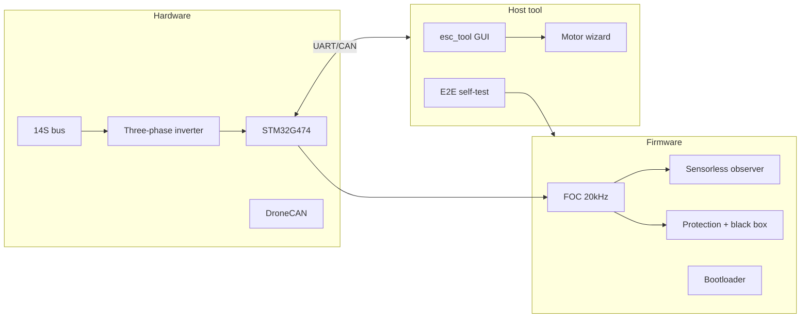
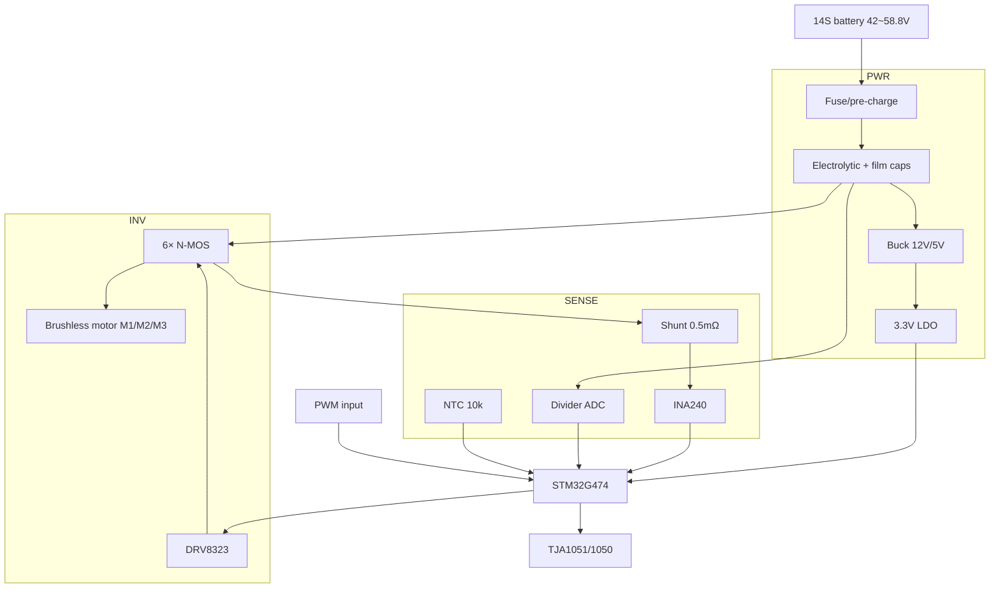
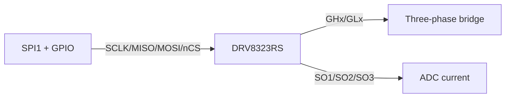

# esc32 Complete Documentation (English)

> English edition of the merged documentation. Auto-merged from all Markdown files in the repository; source files remain in their original directories and can be regenerated with `scripts/merge-md.py`.
> Generated: auto-merge · **28** source files

## Table of Contents

1. [README.md](#readmemd)
2. [docs/项目特点.md](#document-docs项目特点md)
3. [docs/需求实现状态.md](#document-docs需求实现状态md)
4. [docs/可行性分析与技术方案.md](#document-docs可行性分析与技术方案md)
5. [docs/系统闭环.md](#document-docs系统闭环md)
6. [docs/ROADMAP.md](#document-docsroadmapmd)
7. [docs/BUILD.md](#document-docsbuildmd)
8. [docs/命名与系列规范.md](#document-docs命名与系列规范md)
9. [docs/MCU移植与多平台架构.md](#document-docsmcu移植与多平台架构md)
10. [docs/UAVCAN协议栈.md](#document-docsuavcan协议栈md)
11. [docs/生产与标定流程.md](#document-docs生产与标定流程md)
12. [docs/台架验收清单.md](#document-docs台架验收清单md)
13. [docs/hardware/ESC-80硬件原理图.md](#document-docshardwareesc-80硬件原理图md)
14. [docs/hardware/原理图-三相桥详图.md](#document-docshardware原理图-三相桥详图md)
15. [docs/hardware/STM32G474引脚与接口.md](#document-docshardwarestm32g474引脚与接口md)
16. [docs/hardware/BOM-ESC-80.md](#document-docshardwarebom-esc-80md)
17. [docs/hardware/ESC-60硬件概要.md](#document-docshardwareesc-60硬件概要md)
18. [docs/hardware/ESC-120硬件概要.md](#document-docshardwareesc-120硬件概要md)
19. [docs/hardware/IPX6结构与灌封工艺.md](#document-docshardwareipx6结构与灌封工艺md)
20. [hardware/kicad/ESC-80/README.md](#document-hardwarekicadesc-80readmemd)
21. [shared/defaults/README.md](#document-shareddefaultsreadmemd)
22. [firmware/boards/targets/README.md](#document-firmwareboardstargetsreadmemd)
23. [firmware/boards/mcu/stm32g474/README.md](#document-firmwareboardsmcustm32g474readmemd)
24. [firmware/boards/mcu/stm32g431/README.md](#document-firmwareboardsmcustm32g431readmemd)
25. [firmware/boards/mcu/stm32h743/README.md](#document-firmwareboardsmcustm32h743readmemd)
26. [firmware/boards/mcu/at32f415/README.md](#document-firmwareboardsmcuat32f415readmemd)
27. [firmware/comm/cyphal/README.md](#document-firmwarecommcyphalreadmemd)
28. [docs/README.md](#document-docsreadmemd)


---

<!-- Source: README.md -->

## Document: README.md

## esc32

**esc32** is a **FOC brushless ESC** project (firmware + host tool + hardware documentation) for agricultural/industrial multirotors.  
Project name: **esc32** (ESC + 32-bit MCU); protocol identifier `0xEC 0x32`. Clone/rename this repository to directory **`esc32`**.

> For detailed advantages and features, see **[docs/项目特点.md](docs/项目特点.md)**.  
> **Can all requirements be implemented?** See **[docs/需求实现状态.md](docs/需求实现状态.md)** (simulation ✅ / hardware prototype ⏳).

---

## Project Advantages and Features (Summary)

| Dimension | Description |
|------|------|
| **Use case** | Heavy-load FOC, PWM + DroneCAN, for crop spraying / lifting — not a racing DShot route |
| **Closed loop** | PC simulation + `esc_tool` + E2E scripts — tune parameters, verify protocol, run OTA **without hardware** |
| **Product line** | ESC-60/80/120/200 product tiers + multi-MCU (G431/G474/H743/AT32) **single repo, multiple Targets** |
| **Architecture** | Core separated from HAL, VESC-style multi-hardware directories; swap boards without changing FOC |
| **Communication** | UAVCAN DSDL stack + debug protocol + JSON presets and black box |
| **Mass production** | Bootloader/OTA, calibration workflow, bench checklist, ESC-80 hardware docs |
| **Compliance** | In-house FOC, commercial closed-source friendly; no GPL firmware copying |

**Technical highlights**: Sensorless FOC (20 kHz current loop), PLL/SMO, protection state machine, motor alert tones (power-on / link / signal lost), PyQt6 host tool.

---

## Features

| Module | Description |
|------|------|
| FOC | Clarke/Park/SVPWM, 20 kHz current loop, 1 kHz speed loop |
| Sensorless | PLL / SMO, open-loop startup |
| Input | PWM 1050–1950 µs, DroneCAN RawCommand (no bidirectional DShot/BDShot) |
| Board level | ESC-60 / ESC-80 / ESC-120 / ESC-200 |
| OTA | Bootloader erase/CRC/reboot |
| Black box | 64 fault records + NVM |
| Host tool | CLI / PyQt6 GUI / motor wizard / preset JSON |
| Alert tones | Power-on triple tone / first PWM link / lost signal "beep-beep" (`motor_sound_enable`) |

---

## Double-Click Run (Release Package)

```powershell
powershell -ExecutionPolicy Bypass -File scripts\build-release.ps1
```

Output directory **`dist\esc32\`** — double-click **`esc32_start.exe`** (auto-starts simulation + host tool).

| File | Description |
|------|------|
| `esc32_start.exe` | One-click launch (recommended) |
| `esc32_sim.exe` | Simulation only |
| `esc_tool.exe` | Host tool only |
| `defaults\` | 60/80/120/200 presets |

---

## One-Click Closed-Loop Verification

```powershell
powershell -ExecutionPolicy Bypass -File scripts\run-closed-loop.ps1
# Or full build: compile all Targets + E2E
powershell -ExecutionPolicy Bypass -File scripts\verify-all.ps1
```

Build environment (one-click): `powershell -File scripts\setup-build-env.ps1`  
Load PATH in new terminal: `. .\scripts\env.ps1`

---

## Running

```powershell
# Firmware simulation
cd firmware
mingw32-make
.\esc32_sim.exe

# Host tool
cd host
.\.venv\Scripts\python -m esc_tool --gui
.\.venv\Scripts\python -m esc_tool --sim-udp 127.0.0.1:7777 shell

# Apply motor preset
.\.venv\Scripts\python -m esc_tool.preset_apply --sim-udp 127.0.0.1:7777 ..\shared\defaults\80.json
```

---

## Product-Line Builds

Product series `ESC-{60|80|120|200}` decoupled from MCU/Target — see [Naming and Series Conventions](docs/命名与系列规范.md).

```powershell
cd firmware
mingw32-make list-targets
mingw32-make esc80                    # simulation + product 0x80
mingw32-make esc200                   # simulation + product 0x200
mingw32-make target80                 # G474 placeholder HAL
mingw32-make target60                 # ESC-60 + G431
mingw32-make target415                # ESC-80 + AT32F415
mingw32-make target80-hal             # G474 production HAL skeleton
```

- Multi-MCU: [docs/MCU移植与多平台架构.md](docs/MCU移植与多平台架构.md)  
- UAVCAN: [docs/UAVCAN协议栈.md](docs/UAVCAN协议栈.md)

---

## Hardware

- First Target: `ESC80_STM32G474_V1` (MCU **STM32G474**)
- Schematic: [docs/hardware/ESC-80硬件原理图.md](docs/hardware/ESC-80硬件原理图.md)
- System closed loop: [docs/系统闭环.md](docs/系统闭环.md)

---

## Documentation

| Document | Description |
|------|------|
| [Project Features](docs/项目特点.md) | **Advantages, features, use cases** |
| [Naming and Series Conventions](docs/命名与系列规范.md) | Product / MCU / Target |
| [Documentation Index](docs/README.md) | Full documentation index |
| [Build](docs/BUILD.md) | Environment and build |
| [Roadmap](docs/ROADMAP.md) | Version plan |
| [Feasibility Analysis](docs/可行性分析与技术方案.md) | Technical plan |

---

<!-- Source: docs/项目特点.md -->

## Document: docs/项目特点.md

## esc32 Project Overview and Features

> **esc32** (ESC + 32-bit MCU) — an open **FOC vector ESC** project for agricultural/industrial multirotors: firmware, host tool, hardware docs, and simulation closed loop in one repo.  
> Repository directory should be named `esc32` (matches product name).

---

## I. What This Project Is

| Layer | Content |
|------|------|
| **Product** | ESC-60 / 80 / 120 / 200 multi-power-tier agricultural/industrial ESCs |
| **Firmware** | Sensorless FOC, protection, PWM + DroneCAN, OTA, motor alert tones |
| **Host tool** | `esc_tool` (CLI + PyQt6 GUI + motor wizard + presets) |
| **Hardware** | ESC-80 first revision G474 schematic/BOM; G431 / H743 / AT32 planned |
| **Verification** | PC simulation `esc32_sim.exe` + one-click E2E — tune protocol and parameters without a board |

Protocol sync header `0xEC 0x32`, matching the project name for identification and after-sales tooling.

---

## II. Core Advantages

### 1. Agricultural/Industrial Focus, Not a Racing Firmware Fork

- **FOC vector control** — heavy-load thrust and smooth current loop prioritized.
- Throttle via **PWM + UAVCAN** primarily; **no bidirectional DShot**, reducing GPIO and real-time load.
- Full protection: over/under-voltage, over-current, over-temperature, stall, throttle lost, **fault black box**.

### 2. Complete Software Closed Loop — "Software First, Hardware Later"

- Run simulation on boot: `mingw32-make` → `esc32_sim.exe`.
- Release package **`esc32_start.exe`** — double-click to start simulation + host tool.
- **`run-closed-loop.ps1`** auto-build + E2E, suitable for CI and regression.

### 3. Product-Line Architecture — Easy MCU and Power-Tier Extension

- **Product / MCU / Target** three-layer decoupling (see [Naming and Series Conventions](命名与系列规范.md)).
- Multi-MCU registry (G431, G474, H743, AT32F415…), VESC-style **multi `hw_*`** shared core, separate HAL ports.
- One FOC/protocol codebase — **swap Target to swap board**, no firmware forks.

### 4. Communication and Ecosystem

- **UAVCAN v0 DSDL stack**: RawCommand, Status, NodeStatus, GetNodeInfo.
- Private debug protocol (UDP) for production test, calibration, OTA, curves.
- Parameter **JSON presets** (60/80/120/200) + NVM persistence (file in simulation).

### 5. Mass-Production Ready Design

- Bootloader + OTA erase/CRC/reboot flow verified (simulation).
- [Production and Calibration](生产与标定流程.md), [Bench Acceptance Checklist](台架验收清单.md).
- Hardware docs: schematic notes, BOM, pin table, IPX6 potting process (optional).

### 6. In-House, Closed-Source Friendly

- FOC and control laws implemented in-house — **no copying** of GPL ESC firmware.
- Protection and UAVCAN message patterns can reference industry practice; architecture and code ownership are clear.

---

## III. Technical Features at a Glance

| Category | Features |
|------|------|
| Control | Clarke/Park/SVPWM; ~20 kHz current loop; 1 kHz speed loop; PLL/SMO sensorless |
| Input | PWM 1050–1950 µs; DroneCAN RawCommand; debug-port throttle |
| Alert tones | Power-on melody / first PWM link melody / lost signal "beep-beep" (disableable) |
| Host tool | Parameter tree, live curves, motor wizard, batch node_id, OTA |
| Build | MinGW simulation + optional ARM GCC; Makefile multi-Target |
| License & compliance | Compliance boundaries documented; suitable for commercial closed-source products |

---

## IV. Comparison with Common Approaches

| Comparison | esc32 | Typical six-step ESC (e.g. AM32) | Heavy VESC |
|------|-------|-------------------------|-----------|
| Control | FOC | Six-step/BEMF | FOC |
| Use case | Agricultural multirotor heavy load | Racing/general | Skateboard/high-current lab |
| Communication | PWM + DroneCAN | Often DShot | UART/CAN varied |
| Host tool | Dedicated esc_tool + presets | Various configurators | VESC Tool |
| Structure | Multi-Target single repo | Multi-MCU multi-fork | Multi hw_* |

---

## V. Suitable and Unsuitable Use Cases

**Suitable**

- 14S agricultural crop spraying, lifting, and other multirotor **heavy-load FOC ESC** in-house development.
- Teams needing **UAVCAN fleet** + ground calibration/OTA.
- Hardware engineers wanting **simulation first**, then G474/G431 prototyping.

**Unsuitable**

- Racing machines with **DShot/BDShot** primary, ultra-lightweight scenarios.
- Single PCB covering 60 A–200 A full series (requires tiered hardware and current-limit tables).

---

## VI. Current Completion (Honest Assessment)

| Scope | Completion |
|------|--------|
| Simulation + host tool + protocol + E2E | **100%** deliverable |
| Multi-MCU architecture + link verification | **100%** Makefile `verify` |
| Real-hardware FOC flash and run | **0%** (pending G474 CubeMX + PCB) |

See **[Requirements Status](需求实现状态.md)** for details.

---

## VII. Related Documentation

- [README.md](../README.md) — Quick start  
- [Feasibility Analysis and Technical Plan](可行性分析与技术方案.md) — Effort and risk  
- [ROADMAP](ROADMAP.md) — Version roadmap  
- [MCU Porting and Multi-Platform Architecture](MCU移植与多平台架构.md) — Multi-MCU strategy

---

<!-- Source: docs/需求实现状态.md -->

## Document: docs/需求实现状态.md

## esc32 Requirements Implementation Status (Overview)

> Last updated: consistent with current repository code.  
> **Conclusion**: **Software requirements can be fully verified in simulation**; **real-hardware mass production** still requires G474/G431 prototyping and CubeMX HAL — a hardware phase not completable by this repo alone.

---

## I. Can the "Entire Requirement Set" Be Implemented?

| Layer | Status | Notes |
|------|------|------|
| **Simulation software closed loop** | ✅ **Done** | FOC, protocol, host tool, OTA, UAVCAN, alert tones, E2E |
| **Multi-MCU architecture** | ✅ **Done** | Directories, Target, mcu_conf, Makefile link verification |
| **Real driver (G474 first board)** | ⏳ **Pending hardware** | `hal_stm32g474.c` skeleton exists; needs CubeMX + bench |
| **ESC-60 G431 / AT32F415** | ⏳ **HAL stub** | Compiles; cannot flash and run FOC |
| **KiCad source project** | ⏳ **Pending EDA** | Documentation and BOM only |
| **Cyphal / full DSDL** | ⏳ **On demand** | Explicitly out of scope or P4 |

---

## II. Requirement-by-Requirement Checklist

### Product and Architecture

| Requirement | Status | Location |
|------|------|------|
| Project name **esc32** | ✅ | README, protocol `0xEC 0x32` |
| De-branding eft | ✅ | Unified esc32 / esc_tool |
| Product 60/80/120/200 | ✅ | `product.h`, `shared/defaults/` |
| MCU dirs G431/G474/AT32/H743… | ✅ | `mcu_catalog.h`, multi-Target |
| VESC-style multi hw shared core | ✅ | [MCU Porting and Multi-Platform Architecture](MCU移植与多平台架构.md) |
| Project advantages doc | ✅ | [Project Features](项目特点.md) |

### Control and Input

| Requirement | Status | Location |
|------|------|------|
| Sensorless FOC | ✅ simulation | `foc/`, `motor_ctrl/` |
| PWM 1050–1950 µs | ✅ | `comm/pwm_in.c` |
| DroneCAN RawCommand/Status | ✅ | `comm/uavcan/`, `dronecan.c` |
| **No bidirectional DShot** | ✅ out of scope | ROADMAP, feasibility doc |
| Throttle lost protection | ✅ | `pwm_in_is_lost` + `protect.c` |

### Motor Alert Tones (Four Rules)

| Requirement | Status | Location |
|------|------|------|
| 1 Full power-on alert tone | ✅ | `app_init` → `motor_beep_request(MELODY_FULL)` |
| 2 Silent when no PWM | ✅ | Lost detection depends on `link_established` |
| 3 First valid PWM triggers tone again | ✅ | `motor_beep_on_link_established()` |
| 4 "Beep-beep" after link then lost | ✅ | `motor_beep_on_signal_lost()` |
| Disableable | ✅ | `motor_sound_enable` parameter |

### P3 Productization (Software)

| Requirement | Status | Location |
|------|------|------|
| UAVCAN DSDL stack | ✅ | `comm/uavcan/` |
| NodeStatus / GetNodeInfo | ✅ | `dronecan.c` |
| G474 production HAL skeleton | ✅ | `hal_stm32g474.c`, `make target80-hal` |
| ESC-120 H743 Target | ✅ stub | `ESC120_STM32H743_V1` |
| ESC-60 G431 Target | ✅ stub | `ESC60_STM32G431_V1` |
| AT32F415 Target | ✅ stub | `ESC80_AT32F415_V1` |
| Cyphal | ⏸ placeholder | `comm/cyphal/` |
| IPX6 process doc | ✅ | `hardware/IPX6结构与灌封工艺.md` |

### Host Tool and Release

| Requirement | Status | Location |
|------|------|------|
| CLI + GUI + wizard | ✅ | `host/esc_tool/` |
| Preset JSON ×4 | ✅ | `shared/defaults/` |
| One-click release package | ✅ | `scripts/build-release.ps1` |
| One-click closed-loop E2E | ✅ | `scripts/run-closed-loop.ps1` |
| Full verification script | ✅ | `scripts/verify-all.ps1` |

### Hardware (Physical Required)

| Requirement | Status | Notes |
|------|------|------|
| ESC-80 prototype | ⏳ | Schematic/BOM docs exist |
| ESC-60 G431 prototype | ⏳ | [ESC-60 Hardware Overview](hardware/ESC-60硬件概要.md) |
| Bench calibration | ⏳ | [Bench Acceptance Checklist](台架验收清单.md) |
| KiCad source files | ⏳ | `hardware/kicad/ESC-80/README.md` |

---

## III. What You Can Do Now

```powershell
. .\scripts\env.ps1
powershell -File scripts\verify-all.ps1   # build + E2E
cd firmware; .\esc32_sim.exe            # simulation (includes alert tone logs)
cd host; python -m esc_tool --gui        # host tool
```

Real hardware: after completing **STM32G474** CubeMX and filling `hal_stm32g474.c`, you can flash and verify ESC-80.

---

## IV. Recommended Next Steps

1. G474 bench — bring up ESC-80  
2. Reuse G4 HAL → G431 ESC-60  
3. AT32F415 independent HAL → cost tier  
4. H743 → ESC-120  
5. On demand: DSDL Param.GetSet, Cyphal

---

<!-- Source: docs/可行性分析与技术方案.md -->

## Document: docs/可行性分析与技术方案.md

## esc32 UAV ESC Project — Feasibility Analysis and Technical Plan

> Document version: v1.2  
> Date: 2026-05-28  
> Project name: **esc32**  
> Positioning: Agricultural/industrial multirotor FOC vector ESC  

For project advantages and features, see **[Project Features](项目特点.md)**.

---

## I. Overall Conclusion

| Dimension | Assessment |
|------|------|
| **Technical feasibility** | **Feasible, but a medium-to-large industrial project** (~18–36 person-months for first revision) |
| **Commercial closed-source FOC** | **Feasible**; algorithms and architecture in-house, no third-party closed-source firmware copying |
| **Multi-power-tier coverage** | **Requires tiered hardware + tiered firmware**; one PCB should not cover the full series |
| **Highest risks** | Sensorless FOC low-speed/heavy-load start-stop, high-current sampling and thermal design, UAVCAN ecosystem alignment, mass-production calibration system |

**Recommended positioning**: **FOC vector ESC + UAVCAN/PWM dual-mode + professional host tool** for agricultural/industrial multirotors, prioritizing heavy-load thrust smoothness and protection. **No bidirectional DShot (BDShot)**; RPM and status reported via UAVCAN `Status` and host debug protocol — no DShot telemetry on the throttle line.

---

## II. Industry Technical Route Comparison

### 2.1 Six-Step Commutation ESC (Racing/General)

| Item | Content |
|------|------|
| Control | **Six-step commutation + BEMF zero-crossing** (not FOC) |
| Characteristics | Mature, low cost; some schemes closed-source |
| Communication | DShot / PWM, extended telemetry (including **BDShot** in some schemes) |
| For esc32 | Protection/telemetry ideas can be referenced; **main architecture does not use six-step**; **no BDShot** |

### 2.2 Open-Source General ESC (BEMF / Sine)

| Module | Capability |
|------|------|
| MCU | Multiple 32-bit MCU families (STM32, AT32, GD32, etc.) |
| Control | BEMF, sine startup, current/speed/stall PID |
| Input | PWM, DShot, UAVCAN (DroneCAN) |
| Engineering | Bootloader, multi-board targets, relatively complete CAN messages |

**Conclusion**: Reference **Bootloader, UAVCAN messages, PWM input, ADC sampling, protection state machine**; **FOC current loop must be in-house**. Throttle and telemetry primarily **PWM + UAVCAN** — **no bidirectional DShot**.

### 2.3 Open-Source FOC Toolchain

| Layer | Content |
|------|------|
| Host tool | Parameter tree, live data, motor wizard |
| Control | Current loop, speed loop, sensorless observer, field weakening, fault code system |
| License | Often GPL; closed-source products must implement independently |

**Conclusion**: Reference **host interaction and parameter/fault model**; firmware and UI must be developed independently.

### 2.4 Commercial FOC Parameter Model (This Project)

`params.h` covers a full **FOC-level parameter surface** (~120+ items), typically including:

- **Motor model**: KV, Ld/Lq/Rs, pole pairs, max current/RPM
- **Observer**: type, coefficients, filter frequency
- **Three loops**: speed loop, position loop (reserved), current loop coefficients
- **Curves**: PWM curve, accel/decel curves
- **Protection**: over/under-voltage, over-current, stall, over-temperature, power limit
- **Communication**: node_id, CAN baud rate, status report period

**Conclusion**: Use `params.h` + `shared/defaults/` as parameter baseline with in-house protocol and host tool.

---

## III. Target Market Specification Matrix (Per-Axis/ESC Side)

| Tier | Typical voltage | Continuous/peak current* | Single-axis takeoff weight (approx.) | Communication | Control |
|------|----------|----------------|------------------|------|------|
| Light load | 12–14S | Small/medium power | 5–8 kg | PWM + CAN | FOC |
| Medium load | 12–14S | Medium power | 7–13 kg | PWM + CAN | FOC |
| **Heavy load (ESC-80)** | 14S | **60 A / 150 A (3 s)** | **~17 kg** | **UAVCAN + PWM** | FOC |
| Ultra-heavy load | 12–18S | High power | 25–35 kg | CAN | FOC |
| Standalone high-power ESC | 12S | 80–120 A class | Agricultural aircraft | PWM + serial/CAN | FOC |

\* Current ratings differ between integrated power modules and standalone ESCs — design by actual topology.

### 3.1 esc32 Product Line Recommendation

| Model | Voltage | Continuous | Peak | Positioning |
|------|------|----------|------|------|
| ESC-60 | 6–14S | 60 A | 120 A | Light/medium load |
| ESC-80 | 6–14S | 80 A | 150 A | Heavy load (first revision) |
| ESC-120 | 6–18S | 120 A | 200 A+ | Ultra-heavy load |
| ESC-200 | 12–18S | 200 A | 300 A+ | Extra-heavy load |

Each tier: **independent hardware + same firmware core + different `ESC_BOARD_ID` and current-limit table**.

---

## IV. Software and Hardware Technical Plan

### 4.1 Software Architecture

```
esc32/
├── firmware/
├── host/esc_tool/
├── shared/protocol/
└── docs/
```

### 4.2 Control Algorithm Route (Closed-Source In-House)

| Phase | Speed | Method | Notes |
|------|------|------|------|
| Startup | 0 → low | Open-loop I/F or HFI | HFI optional for low-saliency motors |
| Low/mid speed | Low → mid | SMO/PLL observer + current loop | `observer_*` parameters configurable |
| High speed | Mid → high | Observer + field weakening | `field_weakening_*` |
| Heavy load | Full range | Power/current limit, thermal derating | Protection module |

Agricultural heavy-load scenarios **FOC-first**; six-step commutation for comparison or backup only.

**Real-time loops (recommended)**:

- Current loop: 20–40 kHz
- Speed loop: 1–2 kHz
- Communication/protection: 1 kHz

### 4.3 MCU and Hardware Selection

| Tier | Recommended MCU | Rationale |
|------|----------|------|
| ESC-60/80 | **STM32G431/G474** or **AT32F435** | Dual ADC, op-amp, comparator — suitable for FOC |
| ESC-120/200 | **STM32H743** etc. | Compute and multi-channel ADC; high-power external driver |

**Key hardware components**: Low Rdson MOSFETs, shunt sampling, isolated CAN, IPX6 structure (optional).

### 4.4 Communication and Protocol

| Interface | Implementation notes |
|------|----------|
| **PWM** | 1050–1950 µs, calibration and lost protection |
| **UAVCAN / DroneCAN** | RawCommand, Status, StatusExtended |
| **Host tool** | Serial/UDP debug; parameters, OTA, curves, black box |
| **Fault reporting** | Fault codes + NVM black box |
| **DShot / BDShot** | **Not included**; no racing-grade bidirectional throttle telemetry |

### 4.5 Host Tool (esc_tool)

| Module | Description |
|------|------|
| Parameter tree | `params.h` grouped read/write |
| Communication | In-house `ESC_PROTO_*` frame protocol |
| Motor wizard | KV/pole pairs, bench assist |
| Batch | Multi-node node_id configuration |

---

## V. Implementation Principles (Compliance)

| Requirement | Approach |
|------|------|
| Bootloader/OTA | In-house protocol, reference common flow |
| UAVCAN | Standard DSDL messages; stack in-house or license-compatible |
| FOC core | Literature + in-house implementation |
| Parameters | `params.h` + JSON presets |
| Protection | In-house state machine |

---

## VI. Development Phases and Effort (Rough Estimate)

| Phase | Duration | Deliverables |
|------|------|--------|
| **P0** | 2–3 months | One-tier schematic, FOC skeleton, tuning protocol |
| **P1** | 3–4 months | Sensorless FOC, protection, PWM + UAVCAN |
| **P2** | 3–4 months | Multi-board, host tool v1, mass-production calibration |
| **P3** | 3–6 months | Long-term full-load verification, Cyphal (optional), certification docs |

---

## VII. Risks and Mitigations

| Risk | Level | Mitigation |
|------|------|------|
| Heavy-load sensorless start-stop step-out | High | I/F startup, per-motor bench calibration |
| High-current sampling | High | Shunt selection, zero calibration, temp drift compensation |
| Flight-controller protocol version | Medium | First revision DroneCAN compatible |
| Too many parameters | Medium | `shared/defaults/` preset packages |

---

## VIII. Current Project Status

| Phase | Status | Content |
|------|------|------|
| P0 | ✅ | Monorepo, FOC skeleton, debug protocol, CLI |
| P1 | ✅ | PLL/SMO, PWM, DroneCAN RawCommand/Status |
| P2 | ✅ | Multi-board, OTA, black box, GUI |
| P3 | **Software complete** | UAVCAN, multi-MCU Target, alert tones, requirements status doc; real HAL pending prototype |

Simulation: `make` → `esc32_sim.exe`; host tool: `python -m esc_tool --gui`.

---

## IX. Strategic Summary

**In-house closed-source FOC firmware + tiered hardware + parameterized host tool** for agricultural/industrial UAV ESC mass production, calibration, and after-sales.

---

## Appendix: UAVCAN ESC Messages (Subset Implemented in This Project)

- `uavcan.equipment.esc.RawCommand`
- `uavcan.equipment.esc.Status`
- `uavcan.equipment.esc.StatusExtended`
- Firmware OTA (custom debug protocol + Bootloader)

## Appendix: Typical Heavy-Load ESC Public Spec Reference

| Item | Value (industry common) |
|------|------------------|
| Rated voltage | 14S |
| Input voltage | 18–63 V |
| Continuous current | 60 A |
| Peak current (3 s) | 150 A |
| Throttle pulse width | 1050–1950 µs |
| Fault logging | Recommended |

---

*This document is the esc32 project planning baseline; updated as hardware and protocol decisions evolve.*

---

<!-- Source: docs/系统闭环.md -->

## Document: docs/系统闭环.md

## esc32 System Closed Loop

This describes the complete closed loop from **hardware design → firmware → communication → host tool → production calibration → delivery**.

## Closed-Loop Overview



## Phases and Deliverables

| Phase | Goal | Repository deliverables | Acceptance |
|------|------|------------|------|
| **S0 Simulation** | Verify algorithms and protocol without hardware | `esc32_sim.exe`, E2E | `scripts/run-closed-loop.ps1` passes |
| **S1 Hardware prototype** | ESC-80 first board prototype | `docs/hardware/ESC-80硬件原理图.md` | No-load PWM waveform, ADC noise |
| **S2 Bench** | Motor parameter calibration | `shared/defaults/*.json`, wizard | Sensorless startup success >95% |
| **S3 Full aircraft** | 4–8 axis joint tuning | DroneCAN node_id batch | Throttle lost protection, fault logging |
| **S4 Mass production** | OTA + programming | Bootloader, `docs/生产与标定流程.md` | CRC verification, parameter lock to NVM |

## Data Flow (Runtime)

1. **Throttle input**: PWM 1050–1950 µs or DroneCAN `RawCommand` (CAN priority)
2. **Slow loop 1 kHz**: Throttle curve → speed setpoint → protection check
3. **Fast loop 20 kHz**: Current loop Id/Iq → SVPWM → three-phase duty
4. **Observer**: PLL/SMO estimates θ, ω → sensorless commutation
5. **Telemetry**: `GET_TELEM` / DroneCAN `Status` → host curves
6. **Fault**: Protection trigger → black box NVM → host export

## NVM Layout (Simulation `esc32_nvm.bin`)

| Offset | Content |
|------|------|
| `0x0000` | Fault black box 64×18B |
| `0x2000` | Parameter block `esc_params_t` |
| `0x10000` | OTA firmware image slot |

## One-Click Closed-Loop Verification

```powershell
powershell -ExecutionPolicy Bypass -File scripts\run-closed-loop.ps1
```

## Related Documentation

- [ESC-80 Hardware Schematic](hardware/ESC-80硬件原理图.md)
- [STM32G474 Pins](hardware/STM32G474引脚与接口.md)
- [Production and Calibration](生产与标定流程.md)
- [Bench and Acceptance](台架验收清单.md)

---

<!-- Source: docs/ROADMAP.md -->

## Document: docs/ROADMAP.md

## esc32 Development Roadmap


## Completed (Software Closed Loop)


- [x] P0 framework, protocol, CLI

- [x] P1 sensorless FOC, PWM, DroneCAN

- [x] P2 multi-board, OTA, black box, GUI

- [x] Parameter NVM persistence (simulation)

- [x] E2E automation `run-closed-loop.ps1`

- [x] Hardware schematic/BOM/pin docs (ESC-80)

- [x] Motor preset JSON ×4 (60/80/120/200)

- [x] CI workflow (GitHub Actions)


## P3 Productization (Software)


- [x] **UAVCAN DSDL stack** (`comm/uavcan/` + [UAVCAN协议栈.md](UAVCAN协议栈.md))

- [x] **NodeStatus / GetNodeInfo** services

- [x] **ESC-120 H743** Target + HAL placeholder + [ESC-120 Hardware Overview](hardware/ESC-120硬件概要.md)

- [x] **G474 production HAL skeleton** (`hal_stm32g474.c`, `make target80-hal`)

- [x] **Cyphal placeholder** (`comm/cyphal/`, disabled by default)

- [x] **IPX6 potting process** documentation

- [ ] Full DSDL message set / parameter services (GetSet) — extend on demand

- [ ] Cyphal real implementation — after flight-controller requirements are clear


## Hardware Closed Loop (Pending Prototype)


- [ ] KiCad project source `hardware/kicad/ESC-80/` (instructions ready)

- [ ] STM32G474 CubeMX fill `hal_stm32g474.c`

- [ ] Bench calibration and `台架验收清单.md` measured results


## Out of Scope (Confirmed)


- Bidirectional DShot (BDShot): RPM/ESC status via **UAVCAN Status** and **esc_tool**


## Optional Follow-Up


- [x] Motor alert tones (power-on / link / lost "beep-beep", `motor_ctrl/motor_beep.c`)

- [x] ESC-200 Target skeleton (`ESC200_STM32H743_V1`)
- [ ] ESC-200 real HAL + prototype

- [ ] Long-term full-load thermal verification report

---

<!-- Source: docs/BUILD.md -->

## Document: docs/BUILD.md

## esc32 Build and Run

> Project name: **esc32**. Repository root should be named `esc32` (see [Project Features](项目特点.md)).

## Implemented Capabilities (Current Repository)

| Category | Content |
|------|------|
| Control | FOC (Clarke/Park/SVPWM), ~20 kHz current loop, 1 kHz speed loop |
| Sensorless | PLL / SMO observer, open-loop I/F startup then sensorless handoff |
| Input | PWM 1050–1950 µs, debug serial throttle, DroneCAN RawCommand |
| Communication | Private debug protocol (UDP:7777), UAVCAN v0 DroneCAN (UDP:7779 simulation) |
| Protection | Over/under-voltage, over-current, over-temperature, stall, throttle lost |
| Alert tones | Power-on/link triple melody; no alarm before PWM link; "beep-beep" after lost (`motor_sound_enable`) |
| Productization | ESC-60/80/120 board current limits, OTA Bootloader, 64 fault black box records |
| Host tool | CLI + PyQt6 GUI (curves, parameters, wizard, batch, OTA) |

**Run modes**: `ESC_TARGET=ESC_SIM` (PC simulation, default) or specific hardware Target (placeholder HAL, cannot drive real hardware yet).

## Three-Layer Build Variables

| Variable | Meaning | Example |
|------|------|------|
| `ESC_PRODUCT_ID` / `ESC_BOARD_ID` | Product power tier | `0x80` |
| `ESC_TARGET` | Hardware SKU | `ESC80_STM32G474_V1` |
| (auto) `mcu_id` | MCU family | See `firmware/include/mcu_catalog.h` |

Full naming rules: [命名与系列规范.md](命名与系列规范.md)

## Supported MCUs (Registered)

| Status | MCU | Target example |
|------|-----|----------------|
| ✅ | **PC simulation** | `ESC_SIM` |
| ⚠️ placeholder | **STM32G474** | `ESC80_STM32G474_V1` |
| ⚠️ stub | **STM32G431** | `ESC60_STM32G431_V1`, `make target60` |
| ⚠️ stub | **AT32F415** | `ESC80_AT32F415_V1`, `make target415` |
| ⚠️ stub | **STM32H743** | `ESC120/ESC200` + H743, `make target120/200` |
| 📋 | G071, F051, GD32, AT32F421/435 | Registered in `mcu_catalog.h` only |

MCU families align with common programmable ESC 32-bit chip families, extended for FOC high-power tiers.

## Supported Motor Types

| Type | Support |
|------|----------|
| **Three-phase BLDC/PMSM** | ✅ Target; FOC vector control |
| **Sensorless (no Hall/encoder)** | ✅ Implemented (observer + open-loop startup) |
| **Sensored (Hall/encoder)** | ❌ Not implemented (parameters/interface reserved) |
| **Synchronous reluctance / induction** | ❌ Not supported |

Use case: **Agricultural/industrial multirotor outrunner motors** — parameters include KV, pole pairs, Ld/Lq/Rs, max current/RPM (see `params.h` and `shared/defaults/`).

## One-Click Build Environment Setup (Windows)

Run in **admin or normal PowerShell**:

```powershell
cd esc32    # repository root
powershell -ExecutionPolicy Bypass -File scripts\setup-build-env.ps1
```

The script installs and verifies:

| Tool | Purpose |
|------|------|
| **WinLibs GCC** + mingw32-make | PC simulation firmware `esc32_sim.exe` |
| **CMake** | Optional CMake build |
| **GNU Arm Embedded Toolchain** | STM32 cross-compile (`arm-none-eabi-gcc`) |
| **Python venv** | Host tool `esc_tool` (PyQt6, etc.) |

Tools only, no build: `-SkipBuild`; skip ARM: `-SkipArm`; skip winget: `-SkipWinget`.

### Each New Terminal

```powershell
cd esc32
. .\scripts\env.ps1
.\scripts\check-toolchain.ps1
```

### Manual Install (When winget Unavailable)

**Option A — WinLibs (recommended, smaller footprint)**

```powershell
winget install BrechtSanders.WinLibs.POSIX.UCRT
# Add WinLibs mingw64\bin to system PATH, reopen terminal
cd firmware
mingw32-make
```

**Option B — MSYS2**

```powershell
winget install MSYS2.MSYS2
# In "MSYS2 UCRT64" terminal:
pacman -S --needed mingw-w64-ucrt64-gcc mingw-w64-ucrt64-make
export PATH=/ucrt64/bin:$PATH
cd /c/Users/Administrator/Desktop/WORK/esc32/firmware
make
```

### Using CMake

```powershell
cd firmware
cmake -B build -DESC_TARGET=ESC_SIM -DESC_PRODUCT_ID=0x80
cmake --build build --config Release
# Output: build\esc32_sim.exe

mingw32-make list-targets
mingw32-make target80
```

## Running

```powershell
# Terminal 1
cd firmware
.\esc32_sim.exe

# Terminal 2
cd host
.\.venv\Scripts\python -m esc_tool --sim-udp 127.0.0.1:7777 shell
# Or GUI
.\.venv\Scripts\python -m esc_tool --gui
```

## FAQ

| Symptom | Fix |
|------|------|
| `gcc: command not found` | Run `setup-build-env.ps1` or add PATH manually |
| `make: command not found` | Use `mingw32-make`, or create `make` alias in Makefile directory |
| Firewall blocks UDP | Allow `esc32_sim.exe` local 7777/7779 |

---

<!-- Source: docs/命名与系列规范.md -->

## Document: docs/命名与系列规范.md

## esc32 Naming and Product-Line Conventions

> Project name: **esc32** (ESC + 32-bit MCU).  
> Goal: Product series, extensible MCU, fixed entry points for secondary development.  
> MCU families align with common programmable ESC firmware 32-bit MCU coverage, plus FOC high-power tiers.

---

## 1. Three-Layer Naming Model

| Layer | Meaning | Example | Build variable |
|------|------|------|----------|
| **Product** | Power/voltage product series | `ESC-80` | `ESC_PRODUCT_ID=0x80` |
| **MCU Family** | Chip family + HAL port layer | `STM32G474` | `ESC_MCU_STM32G474` (see `mcu_catalog.h`) |
| **Target** | Specific hardware SKU (pins + driver + boot) | `ESC80_STM32G474_V1` | `ESC_TARGET=ESC80_STM32G474_V1` |

Relationship:

```
Target = Product + MCU + hardware revision (Vn)
Firmware binary = f(core algorithms, Target HAL, Product current-limit table)
```

---

## 2. Product Series (Product)

| SKU | ID | Continuous | Peak (3 s) | Typical application |
|-----|-----|----------|----------|----------|
| ESC-60 | `0x0060` | 60 A | 120 A | Light/medium load |
| ESC-80 | `0x0080` | 80 A | 150 A | Heavy load (first revision) |
| ESC-120 | `0x0120` | 120 A | 200 A | Ultra-heavy load |
| ESC-200 | `0x0200` | 200 A | 300 A | Extra-heavy load |

- Header: `firmware/include/product.h`
- Current limits and defaults: `firmware/boards/product.c`
- Motor preset JSON: `shared/defaults/{60|80|120|200}.json` (see [shared/defaults/README.md](../shared/defaults/README.md))

**Compatibility**: Legacy macro `ESC_BOARD_ID` equivalent to `ESC_PRODUCT_ID`.

---

## 3. MCU Family Directory (MCU Catalog)

Aligned with common ESC programmable MCUs, extended for FOC tiers:

| MCU ID | Macro | Vendor | Typical use | HAL directory |
|--------|------|------|----------|----------|
| `0x00` | `ESC_MCU_SIM` | Simulation | PC closed loop | `boards/mcu/sim/` |
| `0x10` | `ESC_MCU_STSPIN32F0` | ST | Integrated predriver small ESC | `boards/mcu/stspin32f0/` (TBD) |
| `0x11` | `ESC_MCU_STM32F051` | ST | Low-power six-step/sine | `boards/mcu/stm32f0/` (TBD) |
| `0x12` | `ESC_MCU_STM32G071` | ST | Mainstream 32-bit ESC | `boards/mcu/stm32g0/` (TBD) |
| `0x13` | `ESC_MCU_STM32G431` | ST | FOC mid tier | `boards/mcu/stm32g431/` (TBD) |
| `0x14` | `ESC_MCU_STM32G474` | ST | **ESC-80 first revision** | `boards/mcu/stm32g474/` |
| `0x15` | `ESC_MCU_STM32H743` | ST | High-power FOC | `boards/mcu/stm32h743/` (TBD) |
| `0x20` | `ESC_MCU_GD32E230` | GD | Small ESC | `boards/mcu/gd32e23/` (TBD) |
| `0x21` | `ESC_MCU_GD32F303` | GD | General | `boards/mcu/gd32f30/` (TBD) |
| `0x30` | `ESC_MCU_AT32F415` | AT | Mainstream alternative | `boards/mcu/at32f415/` (TBD) |
| `0x31` | `ESC_MCU_AT32F421` | AT | Small package | `boards/mcu/at32f421/` (TBD) |
| `0x32` | `ESC_MCU_AT32F435` | AT | High power | `boards/mcu/at32f435/` (TBD) |
| `0x40` | `ESC_MCU_CKS32F051` | CKS | Compatibility registry only, **not recommended for production** | — |

Registry: `firmware/include/mcu_catalog.h`  
String: `esc_mcu_id_to_string()`

---

## 4. Target Naming Rules

### 4.1 Format

```
ESC{product_code}_{MCU_model}_{hardware_revision}

Product code: 60 | 80 | 120 | 200
MCU model: STM32G474, AT32F421 … (datasheet name, uppercase)
Hardware revision: V1, V2 …
```

Examples:

| Target | Description |
|--------|------|
| `ESC_SIM` | PC simulation |
| `ESC80_STM32G474_V1` | ESC-80 + G474 first PCB |
| `ESC60_STM32G431_V1` | ESC-60 + G431 (**priority port**, HAL stub) |
| `ESC80_AT32F415_V1` | ESC-80 cost tier + AT32F415 (HAL stub) |
| `ESC120_STM32H743_V1` | ESC-120 + H743 (planned) |

### 4.2 Target ID Encoding

`target_id` is `uint16_t`, suggested:

- High byte = product ID low byte (e.g. `0x80`)
- Low byte = PCB revision for Product+MCU combo (e.g. `0x81` → V1.1 could be `0x82`)

Example: `ESC80_STM32G474_V1` → `0x8081`

Defined in: `firmware/boards/targets/<TARGET>/target.h`

---

## 5. Repository Directory Conventions

```
firmware/
  include/
    product.h          # Product series
    mcu_catalog.h      # MCU registry
    target.h           # Target selection header
    target_meta.h      # Target metadata API
    board.h            # Compatibility layer
  boards/
    product.c          # Product current-limit tables
    target_meta.c
    mcu_catalog.c
    mcu/               # HAL ports by MCU family
      sim/
      stm32g474/
      stm32g0/         # TBD
      ...
    targets/           # By hardware SKU (selected via include/target.h)
      ESC_SIM/
      ESC80_STM32G474_V1/
  app/ core/ foc/ ...  # Hardware-independent core
shared/
  defaults/            # Product-level parameter presets
  protocol/            # Host protocol
host/esc_tool/      # Host tool
docs/hardware/       # Hardware docs by ESC-xx
```

Multi-MCU sharing (VESC `hw_*` reference): see [MCU移植与多平台架构.md](MCU移植与多平台架构.md).

**Principle**: `foc/`, `motor_ctrl/`, `params/` must not contain GPIO registers; pins only in `targets/*/target.h` + `mcu/*/pinmap.h`.

---

## 6. Build

### Make (simulation default)

```powershell
cd firmware
mingw32-make                          # ESC_SIM + product 0x80
mingw32-make esc60                    # product 0x60
mingw32-make target80                 # STM32G474 placeholder HAL (no flash)
mingw32-make ESC_TARGET=ESC_SIM PRODUCT_ID=0x120
mingw32-make list-targets
```

### CMake

```powershell
cmake -B build -DESC_TARGET=ESC_SIM -DESC_PRODUCT_ID=0x80
cmake --build build
```

---

## 7. New MCU Checklist

1. Add `ESC_MCU_xxx` and description in `mcu_catalog.h`  
2. Create `boards/mcu/<family>/`: `hal_*.c`, `pinmap.h` (optional shared `hal_port.c` timer/ADC template)  
3. Create `boards/targets/ESCxx_<MCU>_V1/target.h`  
4. Register `ESC_TARGET` branch in `include/target.h` and `Makefile` / `CMakeLists.txt`  
5. Update `docs/hardware/` pin table and BOM  
6. Bootloader: ST-LINK / GD-Link / AT-Link per vendor (match chip)  
7. Pass `run-closed-loop.ps1` (simulation) before bench  

---

## 8. New Target (Same MCU, Different PCB)

1. Copy `boards/targets/ESC80_STM32G474_V1/` → `..._V2/`  
2. Update `ESC_TARGET_ID`, `pinmap`, BOM docs  
3. Do not change `mcu_catalog` (unless changing chip)  

---

## 9. Debug Protocol GET_INFO (v2)

| Field | Type | Description |
|------|------|------|
| proto_version | u8 | `2` |
| mcu_id | u8 | `mcu_catalog.h` |
| product_id | u16 | `0x0060` … |
| fw_version | u16 | major.minor |
| target_id | u16 | e.g. `0x8081` |
| hw_revision | u16 | PCB revision |
| name | char[16] | `ESC_TARGET_FIRMWARE_NAME` |
| build_date | char[12] | Build date |

Host tool `esc_tool` compatible with v1 short packet.

---

## 10. Preset JSON Naming

Filenames use power-tier digits only, matching product ID:

```
shared/defaults/60.json
shared/defaults/80.json
shared/defaults/120.json
shared/defaults/200.json
```

---

*Revision history: v1.0 established Product / MCU / Target three-layer model and AM32-aligned MCU table.*

---

<!-- Source: docs/MCU移植与多平台架构.md -->

## Document: docs/MCU移植与多平台架构.md

## MCU Porting and Multi-Platform Architecture (VESC Reference)

> esc32 goal: **One FOC/protocol/protection core**, multiple MCUs/PCBs via **Target + HAL + mcu_conf**, aligned with [VESC](https://github.com/vedderb/bldc) `hw_*` multi-hardware directories, with agricultural ESC product layering (Product / MCU / Target).

---

## 1. Selection Conclusion (Matches Your Table)

| MCU | Suitable products | FOC | Key peripherals | esc32 status | Port priority |
|-----|----------|-----|----------|------------|------------|
| **STM32G431** | **ESC-60 / light-medium load** | ✅ Recommended | Dual ADC, built-in op-amp, FDCAN | `ESC60_STM32G431_V1` stub | **P0** (first after G474) |
| **STM32G474** | ESC-80 first revision | ✅ | Same G4 family, more pins | `ESC80_STM32G474_V1` | **In progress** |
| **AT32F415** | Small/medium ESC / ESC-80 cost tier | ✅ | Dual ADC, often external INA | `ESC80_AT32F415_V1` stub | **P1** |
| AT32F421 | Small ESC | Tight | Small package | Directory planned | P2 |
| STM32H743 | ESC-120/200 | ✅ | High compute | `ESC120_STM32H743_V1` stub | P1 |

**Not recommended** to run full esc32 FOC on F051/G071; small ESCs should be a trimmed variant.

---

## 2. Correspondence with VESC

| VESC (bldc) | esc32 | Notes |
|-------------|-------|------|
| `motor/mcconf`, `appconf` | `params.h` + `shared/defaults/` | Parameters and product presets |
| `hw_60/hw_60.h`, `hw_75_300`… | `boards/targets/ESCxx_MCU_Vn/target.h` | **One Target per board** |
| `HW_HAS_3_SHUNTS`, `HW_HAS_PHASE_FILTERS`… | `boards/mcu/*/mcu_conf.h` | **Capability macros**, see `mcu_port.h` |
| `mcpwm_f1.c` / `mcpwm.c` per MCU | `boards/mcu/<family>/hal_*.c` | HAL only, split by file |
| `conf_general` selects hw | `make target60` / CMake `ESC_TARGET` | **Compile-time selection**, no runtime hw switch |
| Shared `foc.c`, `virtual_motor` | `foc/`, `motor_ctrl/` | Hardware-independent |

VESC essence: **Core unchanged, stack hw directories + minimal `#ifdef`**. esc32 uses **Target selects HAL source + mcu_conf macros**, avoiding `#if defined(STM32G4)` in `app.c`.

---

## 3. Three-Layer Directory (Shared Core)

```
                    ┌─────────────────────────┐
                    │ app / foc / protection  │  ← All MCUs share
                    │ comm / params / boot    │
                    └───────────┬─────────────┘
                                │ hal.h (fixed API)
                    ┌───────────▼─────────────┐
                    │ platform/hal.h          │
                    │ platform/mcu_port.c     │  ← Read mcu_conf capabilities
                    └───────────┬─────────────┘
          ┌─────────────────────┼─────────────────────┐
          ▼                     ▼                     ▼
   boards/mcu/sim/      boards/mcu/stm32g431/   boards/mcu/at32f415/
   hal_sim.c            hal_stub → hal_*.c      hal_stub → hal_*.c
                        mcu_conf.h              mcu_conf.h
                        pinmap.h                pinmap.h
          │                     │                     │
          └─────────────────────┴─────────────────────┘
                                │
                    boards/targets/ESC60_STM32G431_V1/
                    boards/targets/ESC80_STM32G474_V1/
                    boards/targets/ESC80_AT32F415_V1/
```

### 3.1 STM32G4 **Same-Family Reuse** (G431 ← G474)

- Common: `boards/mcu/stm32g4/mcu_conf_common.h`
- Suggested real HAL: `hal_g4_pwm.c`, `hal_g4_adc_inj.c` **shared G431/G474**
- Differences only in `pinmap.h`, ADC channels, Flash size

### 3.2 AT32 **Independent HAL Tree**

- Use Artery official library — **do not** link with `stm32g4xx_hal` in same ELF
- Reusable: FOC math, protocol, protection state machine, UAVCAN stack
- Rewrite: `hal_pwm_set`, `hal_adc_read`, CAN, NVM, clock

---

## 4. New MCU Checklist

1. Register ID in `mcu_catalog.h`  
2. `boards/mcu/<mcu>/`: `mcu_conf.h`, `pinmap.h`, `hal_stub.c` → `hal_<mcu>.c`  
3. `boards/targets/ESCxx_<MCU>_V1/target.h`  
4. `include/target.h` add `#elif` + `mcu_conf` include  
5. `Makefile` add `targetXX` rule  
6. `docs/hardware/` schematic notes  
7. `shared/defaults/xx.json` current limits match product  

---

## 5. Build Examples

```powershell
cd firmware
mingw32-make list-targets
mingw32-make target60      # ESC-60 + G431 link verification
mingw32-make target80      # ESC-80 + G474
mingw32-make target415     # ESC-80 + AT32F415
mingw32-make target80-hal  # G474 production HAL skeleton
```

---

## 6. Capability Query API

In firmware:

```c
const esc_mcu_caps_t *c = esc_mcu_capabilities();
// c->dual_adc, c->recommended_product, c->port_status ...
```

Host tool can extend `GET_INFO` with `mcu_id` / `port_status` (already has `target_id`, `mcu_id` fields).

---

## 7. Reference Links

- VESC hardware definitions: `hw_*` directories and `HW_NAME` compile switch  
- esc32 series conventions: [命名与系列规范.md](命名与系列规范.md)  
- G474 pins: [hardware/STM32G474引脚与接口.md](hardware/STM32G474引脚与接口.md)

---

<!-- Source: docs/UAVCAN协议栈.md -->

## Document: docs/UAVCAN协议栈.md

## UAVCAN / DroneCAN Protocol Stack (P3)

esc32 implements **UAVCAN v0 transport layer + DSDL encode/decode** in P3, compatible with common flight-controller DroneCAN ESC subset.

---

## Directory Structure

```
firmware/comm/uavcan/
  uavcan.c          # Single/multi-frame, CRC, tail byte
  uavcan_crc.c      # CRC-16-CCITT-FALSE
  uavcan_dsdl.c     # Message encode/decode
  uavcan.h / uavcan_dsdl.h
firmware/comm/dronecan.c   # ESC node logic
```

---

## Implemented Messages

| DSDL | ID | Direction |
|------|-----|------|
| `uavcan.equipment.esc.RawCommand` | 1030 | RX |
| `uavcan.equipment.esc.Status` | 1034 | TX |
| `uavcan.equipment.esc.StatusExtended` | 1035 | TX |
| `uavcan.protocol.NodeStatus` | 341 | TX 1 Hz |
| `uavcan.protocol.GetNodeInfo` | 1 | Service response |

---

## Behavior

- **RawCommand**: Decode throttle by `esc_index`; zero after timeout `ppm_lost_time_ms`
- **NodeStatus**: Broadcast every second for ground station/flight controller discovery
- **GetNodeInfo**: Respond with `device_name` and hardware revision

Simulation CAN uses UDP **7779** (consistent with `hal_sim.c`).

---

## Testing

```powershell
# Terminal 1
cd firmware
mingw32-make
.\esc32_sim.exe

# Terminal 2
python scripts/test-uavcan.py
```

---

## Cyphal

UAVCAN v1 (Cyphal) disabled by default — see `firmware/comm/cyphal/README.md`.

---

<!-- Source: docs/生产与标定流程.md -->

## Document: docs/生产与标定流程.md

## Production and Calibration Workflow

## 1. Incoming Material and PCBA

| Step | Content |
|------|------|
| IQC | MOS/driver/op-amp batch, NTC resistance spot check |
| AOI | Three-phase bridge, high-current paths, isolated CAN |
| ICT | 3.3V/5V, gate driver power-up, ADC bias |

## 2. Firmware Programming

| Item | Description |
|------|------|
| Bootloader | 0x08000000, 8–16 KB |
| Application | From 0x08004000 |
| Tools | STM32CubeProgrammer / OpenOCD |
| Simulation OTA verification | `esc_tool` → firmware OTA page |

## 3. Board Test (No Motor)

1. 12 V current-limited power-on, measure 3.3V/5V
2. Oscilloscope: three-phase PWM 1 kHz no-load, dead time ~500 ns
3. Serial `PING` / `GET_INFO`
4. CAN 120 Ω termination, read periodic `Status` frames

## 4. Bench Calibration (With Motor)

| Order | Operation | Host tool |
|------|------|--------|
| 1 | Pole pairs / direction | Motor wizard |
| 2 | Resistance R, inductance L (LCR or step) | Write `motor_rs/ld/lq` |
| 3 | Open-loop startup current | Start with reduced `ibus_max` |
| 4 | Sensorless handoff | `observer_type` 0=PLL / 1=SMO |
| 5 | Speed loop Kp/Ki | Monitor RPM step response |
| 6 | Protection thresholds | Over-current/over-temp/under-voltage |
| 7 | `SAVE_PARAMS` | Lock to NVM |

Preset JSON: `shared/defaults/80.json`

## 5. Full Aircraft Integration

- 4/6/8 axis `node_id` batch configuration (GUI batch page)
- PWM and CAN throttle switching
- Throttle lost: disconnect PWM, confirm `THROTTLE_LOST` and motor stop
- Fault black box: intentional over-current, export records

## 6. Shipment

- Parameter CRC and `config_name` printed on label
- Firmware version `GET_INFO.fw_version`
- Save bench report (`docs/台架验收清单.md`)

---

<!-- Source: docs/台架验收清单.md -->

## Document: docs/台架验收清单.md

## Bench Acceptance Checklist

## Simulation Closed Loop (No Hardware)

- [ ] `scripts/run-closed-loop.ps1` all OK
- [ ] GUI connects UDP, curves show RPM/current
- [ ] Parameter read/write + SAVE retained after simulation restart
- [ ] OTA erase/write/CRC no errors

## ESC-80 Hardware Prototype

### Electrical Safety

- [ ] No MOSFET shoot-through on power-up without motor
- [ ] Bus reverse-polarity protection (if present) effective
- [ ] NTC open/short detection

### Control Performance

- [ ] 1050 µs stop, 1950 µs full throttle
- [ ] Sensorless startup 10 attempts ≥9 success
- [ ] 60 A current limit action (bench current source)
- [ ] Over-temp derating / fault codes correct

### Communication

- [ ] DroneCAN 1 Mbps `RawCommand` response
- [ ] `Status` 50 ms period stable
- [ ] PWM lost disarm within 500 ms

### Alert Tones (`motor_sound_enable=1`)

- [ ] One full triple melody on power-up
- [ ] After power-up, no PWM: no "beep-beep" alarm
- [ ] First valid PWM (800–2200 µs) triggers full melody again
- [ ] After link, PWM disconnected: periodic "beep-beep" + `THROTTLE_LOST`

### Reliability

- [ ] Black box ≥1 record readable
- [ ] Application starts normally after OTA
- [ ] 30 min continuous run temperature rise < design value

## Record Template

| Item | Standard | Measured | Result |
|------|------|------|------|
| Continuous current | 80 A | | |
| Peak 3 s | 150 A | | |
| Efficiency @50% throttle | >95% | | |
| Throttle lost time | <500 ms | | |

---

<!-- Source: docs/hardware/ESC-80硬件原理图.md -->

## Document: docs/hardware/ESC-80硬件原理图.md

## ESC-80 Hardware Schematic Design Notes

> Target tier: Agricultural heavy-load ESC-80 (14S / 60 A continuous / 150 A peak)  
> MCU: **STM32G474RET6** (LQFP64)  
> Gate driver: **DRV8323RS** (SPI + three-phase) or **EG2133** (low cost)  
> Current sensing: **INA240A2** ×3 (low-side shunt) or **2-shunt + reconstruction**

This document provides **recommended topology, schematic-level connections, key components**. Before prototype, redraw in KiCad per netlist and run DRC/thermal simulation.

---

## 1. System Block Diagram



---

## 2. Three-Phase Inverter Main Circuit (Schematic Level)

### 2.1 Topology

Three-phase **two-level B6 inverter bridge**, low-side source through **Rshunt** to power ground `PGND`, motor neutral floating (sensorless FOC).

```
                    VBAT+
                      |
         +------------+------------+
         |            |            |
        Q1           Q3           Q5
    AH |            |            |
       +-- Phase A --+-- Phase B --+-- Phase C --→ to motor
        Q2           Q4           Q6
    AL |            |            |
         +-----+-----+-----+-----+
               |     |     |
              RsA   RsB   RsC   (each 0.5mΩ / 1W or 2× parallel)
               |     |     |
              PGND (power ground, single point to signal ground)
```

### 2.2 MOSFET Selection (ESC-80)

| Parameter | Recommendation |
|------|------|
| Vds | ≥ 100 V (14S recommend 100–120 V) |
| Rds(on) | ≤ 2.5 mΩ @ 10 Vgs |
| Id continuous | ≥ 80 A (parallel or single 100A+) |
| Package | TO-263 / LFPAK56 / direct copper-base solder |
| Examples | NCE6080K, IPT015N10N5, CSD19534, etc. |

Each leg **1× or 2× parallel**; high and low side **independently driven**.

### 2.3 Bus Capacitors

| Location | Value | Notes |
|------|------|------|
| Electrolytic | 470–680 µF ×2 | Low ESR, near bridge legs |
| Film | 2.2–4.7 µF ×6 | HF ripple, tight to MOSFETs |
| Recommended voltage | ≥ 100 V | 18S reserve: 120 V |

---

## 3. Gate Driver (DRV8323RS Example)



### 3.1 Key Connections

| DRV8323 pin | Connection |
|--------------|------|
| VCP, VM | Bootstrap: each high-side Bootstrap diode 1N4148 + 100 nF to SHx |
| INHx / INLx | TIM1 CHx / CHxN (see pin table) |
| GND | PGND (single point to AGND via 0Ω/ferrite bead) |
| nFAULT | MCU EXTI, 10 kΩ pull-down |
| VREF | 3.3 V, 0.1 µF decoupling |
| CSA / CSB / CSC | Can use internal amp; this design uses external INA240 |

**Dead time**: TIM1 BDTR `DTG` ≈ 500–800 ns (20 kHz PWM).

**Alternative**: **EG2133** + discrete bootstrap (cost priority, no SPI diagnostics).

---

## 4. Current Sensing (Three-Phase Low-Side Shunt)

```
SHx (0.5mΩ) ──→ INAx+ / INAx- ──→ INA240A2 (gain 50V/V)
                      │
                     Vout ──→ RC 100Ω + 100pF ──→ MCU ADC (1.65V bias)
```

| Channel | MCU ADC | Notes |
|------|---------|------|
| Iu | ADC1_IN1 (PA0) | Phase A low-side |
| Iv | ADC1_IN2 (PA1) | Phase B |
| Iw | ADC1_IN3 (PA2) | Phase C (or save 1 channel via Ia+Ib+Ic=0) |
| Ibus | ADC2_IN8 (PC2) | Bus Hall or shunt |

- **Bias**: 1.65 V (3.3V via 10k/10k, op-amp follower)
- **Range**: ±80 A → 0.5 mΩ × 50 × 80 = 2.0 V peak (current limit/gain adjustable)
- **Sampling**: TIM1 center-aligned CC4 triggers ADC injected sequence

---

## 5. Bus Voltage and Temperature

### 5.1 Vbus Divider

```
VBAT+ ── R1 390k ──┬── ADC (PC0)
                   │
                  R2 10k ── GND
                   │
                  C1 1nF
```

Ratio ~ **1:40** → 58.8 V → 1.47 V. ADC reference 3.3 V.

### 5.2 NTC (MOSFET Temperature)

```
3.3V ── 10k ──┬── ADC (PC3)
              NTC 10k@25°C (on copper bar)
              └── GND
```

B-value 3435; software Steinhart or lookup table.

---

## 6. MCU Minimum System (STM32G474)

| Function | Pin | Peripheral |
|------|------|------|
| PWM U | PA8 / PB13 | TIM1_CH1 / CH1N |
| PWM V | PA9 / PB14 | TIM1_CH2 / CH2N |
| PWM W | PA10 / PB15 | TIM1_CH3 / CH3N |
| ADC current | PA0–PA2 | ADC1 injected |
| ADC Vbus | PC0 | ADC12 |
| ADC NTC | PC3 | ADC12 |
| CAN TX/RX | PB8 / PB9 | FDCAN1 (or PB12/PB13 remap) |
| UART debug | PA2 / PA3 | USART2 |
| PWM input | PA6 | TIM3_CH1 input capture |
| SPI driver | PA5–PA7, PB12 | SPI1 → DRV8323 |
| Boot0 | PB8 test point | 10k pull-up |
| SWD | PA13/PA14 | Debug |

See [STM32G474引脚与接口.md](STM32G474引脚与接口.md) for details.

---

## 7. CAN Bus (DroneCAN)

```
MCU CAN_TX ── 22Ω ──┬── CANH ── TJA1051 ── JST-GH 4Pin
MCU CAN_RX ── 22Ω ──┤
                    └── CANL
            120Ω termination (on-board jumper optional)
            TVS CANHD/CANLD
```

- **Baud rate**: 1 Mbps (common for agricultural flight controllers)
- **Isolation** (recommended): TD5013 / ISO1050 + isolated power
- **Connector**: 4-pin CAN + 2-pin power (per customer harness)

---

## 8. PWM Throttle Input

```
External receiver ── 100Ω ── 2.2k ──┬── PA6 (TIM3_IC1)
                                    │
                                   TVS 3.6V
                                    │
                                   GND
```

- Range: 1050–1950 µs (parameter calibration available)
- Lost: >500 ms no edge → protection

---

## 9. Power Tree

| Rail | Source | Load |
|----|------|------|
| VBAT | 6–14S | Inverter bridge |
| 12V | Buck LM5164 / MP9486 | Gate driver VM, fan |
| 5V | LDO or secondary Buck | CAN transceiver, Hall |
| 3.3V | AMS1117-3.3 / AP2112 | MCU, op-amp, logic |

**MCU analog ground**: Star point, ground pour under ADC, away from dv/dt nodes.

---

## 10. Protection and Auxiliary

| Circuit | Implementation |
|------|------|
| Hardware over-current | DRV8323 OCP / comparator window |
| Bus over-voltage | Resistor divider + comparator or software |
| Pre-charge | PTC + relay/MOS current limit (high-power tiers) |
| Reverse polarity | P-channel MOSFET or ideal diode controller |
| Brake | Low-side 100% duty (parameter `fast_stop`) |

---

## 11. PCB Layout Guidelines

1. **Minimize power loop area**: VBAT+ → MOSFET → motor → PGND
2. **Kelvin shunt connection**: Sense lines not through high-current copper
3. **Gate loop**: Driver tight to MOSFET, trace <10 mm
4. **Thermal**: Large copper under MOSFET + aluminum base or heatsink
5. **EMI**: Film caps at bridge legs; CAN common-mode choke optional

---

## 12. BOM Summary (ESC-80)

| Ref | Example part | Qty | Notes |
|------|----------|------|------|
| Q1–Q6 | NCE6080K | 6 | Parallel for current if needed |
| U_DRV | DRV8323RS | 1 | Or EG2133×3 |
| U_MCU | STM32G474RET6 | 1 | |
| U_CAN | TJA1051T | 1 | Isolated: ISO1050 |
| U_IA | INA240A2 | 3 | 50V/V |
| Rshunt | 0.5 mΩ 1W | 3 | 2512 |
| Cbus | 680 µF/100V | 2 | Low ESR |
| Buck | LM5164 | 1 | 60V input |

Full BOM: [BOM-ESC-80.md](BOM-ESC-80.md).

---

## 13. Firmware Mapping

| Hardware | Firmware module |
|------|----------|
| TIM1 PWM | `hal_pwm_set()` |
| ADC injected | `hal_adc_read()` |
| FDCAN | `hal_can_*()` / `dronecan.c` |
| TIM3 IC | `hal_pwm_input_us()` |
| Flash | `params` / `fault_log` / `boot` |
| Board ID | `ESC_BOARD_ID=0x80` |

Firmware pin map: `firmware/boards/mcu/stm32g474/pinmap.h`

---

## 14. KiCad Next Steps

1. Create project `hardware/kicad/ESC-80/` per net names in this chapter
2. Import `pinmap.h` netlist constraints
3. DRC + current density (IPC-2152)
4. Thermal imaging no-load/loaded before prototype

*Schematic is design guidance; EMC/safety lab review required before mass production.*

---

<!-- Source: docs/hardware/原理图-三相桥详图.md -->

## Document: docs/hardware/原理图-三相桥详图.md

## Schematic Detail — Single Bridge Leg (Phase A; B/C identical)

Below is an **ASCII schematic** for review; KiCad symbols should follow these nets.

## Phase A High + Low Bridge + Low-Side Sensing

```
VBAT+ o───────────────────────────────────────────────┐
                                                      │
                    ┌── Cbootstrap (100nF/100V) ──┐   │
                    │                              │   │
              D_boot├──────┐                       │   │
                    │      │                       │   │
                    │    [Q1 AH]  N-MOS           │   │
                    │      │  D-S                 │   │
                    │      ├──────────● PHASE_A ──┼───┼──→ to motor phase A
                    │      │                       │   │
                    │    [Q2 AL]  N-MOS           │   │
                    │      │                       │   │
                    │      ├──── RsA (0.5mΩ) ──────┼───┤
                    │      │         │              │   │
                    │      │    Kelvin+ ──→ INA+   │   │
                    │      │    Kelvin- ──→ INA-   │   │
                    │      │         │              │   │
                    └──────┴─────────┴──────────────┴───┴── PGND
```

## INA240 Current Amplifier

```
                    3.3V
                     │
                    10k
                     │
         INA240 V+ ──┴── Vref 1.65V (divider midpoint)
              │
    RsA+ ─────┤+
              │ OUT ── 100Ω ── 100pF ──→ MCU ADC (PA0)
    RsA- ─────┤-
              │
         INA240 V- ── PGND (signal ground, single point)
```

## Gate Driver to MOSFET (Simplified)

```
DRV8323 GH1 ── 10Ω ──┬── Q1 Gate
                      └── 10k pull-down

DRV8323 GL1 ── 10Ω ──┬── Q2 Gate
                      └── 10k pull-down

DRV8323 SH1 ── to Q2 Source / RsA high-side reference (bootstrap ground)
```

## Dead Time and Freewheeling

- After high-side off, low-side body diode freewheels, current through RsA
- **Prohibit** high/low shoot-through; TIM1 complementary + dead-time register

## Full Three-Phase

Duplicate above for phase B (PHASE_B), phase C (PHASE_C): 6 MOSFETs + 3 shunts + 3 INA240.

---

*Use together with [ESC-80硬件原理图.md](ESC-80硬件原理图.md).*

---

<!-- Source: docs/hardware/STM32G474引脚与接口.md -->

## Document: docs/hardware/STM32G474引脚与接口.md

## STM32G474 Pin and Interface Assignment (ESC-80)

Consistent with `firmware/boards/mcu/stm32g474/pinmap.h`.

## TIM1 — Three-Phase Center-Aligned PWM

| Signal | Pin | Timer |
|------|------|--------|
| UH | PA8 | TIM1_CH1 |
| UL | PB13 | TIM1_CH1N |
| VH | PA9 | TIM1_CH2 |
| VL | PB14 | TIM1_CH2N |
| WH | PA10 | TIM1_CH3 |
| WL | PB15 | TIM1_CH3N |
| TRGO | CC4 | ADC injected trigger |

## ADC

| Signal | Pin | ADC |
|------|------|-----|
| Iu | PA0 | ADC1_IN1 |
| Iv | PA1 | ADC1_IN2 |
| Iw | PA2 | ADC1_IN3 |
| Vbus | PC0 | ADC12_IN6 |
| NTC | PC3 | ADC12_IN9 |
| Ibus | PC2 | ADC12_IN8 |

## Communication

| Signal | Pin | Peripheral |
|------|------|------|
| CAN_TX | PB9 | FDCAN1_TX |
| CAN_RX | PB8 | FDCAN1_RX |
| UART_TX | PA2 | USART2_TX (debug) |
| UART_RX | PA3 | USART2_RX |
| PWM_IN | PA6 | TIM3_CH1 IC |

## DRV8323 SPI

| Signal | Pin |
|------|------|
| SCK | PA5 |
| MISO | PA6* |
| MOSI | PA7 |
| nCS | PB12 |
| nFAULT | PB11 EXTI |

\* If PA6 used for PWM input, remap SPI to PA5/PA7 + PB14 etc. per actual PCB.

## Other

| Signal | Pin |
|------|------|
| LED | PC6 |
| BOOT0 | Test point |
| SWD | PA13/PA14 |

## Clock Recommendation

- HSE 16 MHz → PLL 170 MHz system clock
- ADC clock ≤ 60 MHz, 20 kHz × 3 channel injected sampling

---

<!-- Source: docs/hardware/BOM-ESC-80.md -->

## Document: docs/hardware/BOM-ESC-80.md

## BOM — ESC-80 (Suggested First Revision)

| # | Ref | Qty | Part/spec | Vendor ref | Notes |
|---|------|------|-----------|----------|------|
| 1 | Q1–Q6 | 6 | N-MOS 100V 80A+ | NCE6080K | Parallel if needed |
| 2 | U1 | 1 | STM32G474RET6 | ST | LQFP64 |
| 3 | U2 | 1 | DRV8323RS | TI | Gate driver |
| 4 | U3–U5 | 3 | INA240A2 | TI | Current op-amp |
| 5 | U6 | 1 | TJA1051T | NXP | CAN |
| 6 | U7 | 1 | LM5164 | TI | Buck 12V |
| 7 | U8 | 1 | AP2112K-3.3 | Diodes | 3.3V LDO |
| 8 | Rsh1–3 | 3 | 0.5 mΩ 1W 2512 | Kelvin | Shunt |
| 9 | Cbus1–2 | 2 | 680 µF/100V | Low ESR | Electrolytic |
| 10 | Cx | 6 | 2.2 µF/100V 1206 | Film | HF |
| 11 | NT1 | 1 | NTC 10k B3435 | On copper bar | Temp sense |
| 12 | F1 | 1 | Fuse 80A | | Bus |
| 13 | J1 | 1 | Motor 3-pin high current | | Copper bar |
| 14 | J2 | 1 | Power 2-pin XT90 | | |
| 15 | J3 | 1 | CAN 4-pin | JST-GH | |
| 16 | J4 | 1 | PWM 3-pin | | Throttle |

**Alternate MCU tiers**

| Part | ESC tier | Notes |
|------|--------|------|
| STM32G431 | ESC-60 | Pin-compatible simplified |
| STM32G474 | ESC-80 | Recommended |
| STM32H743 | ESC-120 | CAN-FD, compute headroom |

---

<!-- Source: docs/hardware/ESC-60硬件概要.md -->

## Document: docs/hardware/ESC-60硬件概要.md

## ESC-60 Hardware Overview (STM32G431)

> Light/medium load agricultural multirotor per-axis ESC (~60 A continuous / 120 A peak)  
> Target: `ESC60_STM32G431_V1`  
> MCU: **STM32G431CBU6** (UFQFPN48)

---

## 1. Selection Rationale

| Item | Description |
|----|------|
| Compute | Cortex-M4 + FPU, meets 20 kHz FOC |
| Analog | **Dual ADC + built-in op-amp**, simple shunt sampling chain |
| Same family | Shares `stm32g4/mcu_conf_common.h` and HAL reuse with ESC-80 **G474** |
| Package | 48-pin suits compact ESC |

---

## 2. Recommended Topology

- Three-phase inverter + **DRV8323** or **EG2133** (cost tier)
- Three low-side shunts + G431 built-in OPAMP buffer (or INA240)
- **FDCAN** flight bus + **PWM** throttle backup
- 14S bus: electrolytic + film caps, Buck/LDO 3.3V

Pin draft: `firmware/boards/mcu/stm32g431/pinmap.h`

---

## 3. Firmware

```powershell
mingw32-make target60   # Link verification esc32_ESC60_STM32G431_V1.elf
```

Real hardware: derive `hal_stm32g431.c` from G474 `hal_stm32g474.c`, change ADC channels and pins only.

---

## 4. Differences from ESC-80

| Item | ESC-60 | ESC-80 |
|----|--------|--------|
| MCU | G431 | G474 |
| Continuous current | 60 A | 80 A |
| PCB | Smaller, lighter | Heavy-load copper/heatsink |

Preset: `shared/defaults/60.json`

---

<!-- Source: docs/hardware/ESC-120硬件概要.md -->

## Document: docs/hardware/ESC-120硬件概要.md

## ESC-120 Hardware Overview (STM32H743)

> P3 planned board: Ultra-heavy load agricultural multirotor (120 A continuous / 200 A peak)  
> Target: `ESC120_STM32H743_V1`  
> MCU: **STM32H743VIT6** (or same series LQFP208, per prototype)

---

## 1. Differences from ESC-80

| Item | ESC-80 (G474) | ESC-120 (H743) |
|----|---------------|----------------|
| Continuous current | 80 A | 120 A |
| Peak (3 s) | 150 A | 200 A |
| MCU | STM32G474 | STM32H743 |
| Current sensing | 3-shunt low-side | 3-shunt + higher bandwidth ADC |
| Gate driver | DRV8323 | DRV8323 / high-power predriver |
| Potting | Optional | **IPX6 potting recommended** |

---

## 2. Recommended Peripherals

- **TIM1**: Three-phase center-aligned PWM, 20 kHz
- **ADC1/2/3**: Injected synchronized three-phase current sampling
- **FDCAN1**: DroneCAN 1 Mbps
- **TIM3**: PWM throttle input capture (PA6 or remap)
- **SPI**: DRV8323 configuration

Pin draft: `firmware/boards/mcu/stm32h743/pinmap.h`.

---

## 3. Firmware Build

```powershell
cd firmware
mingw32-make target120
```

Currently **HAL placeholder** — complete schematic + CubeMX then replace `hal_stub.c`.

---

## 4. Next Steps

1. KiCad schematic (reference ESC-80 topology, larger MOSFETs/copper)
2. Thermal simulation and NTC layout
3. `hal_stm32h743.c` and bench acceptance

---

<!-- Source: docs/hardware/IPX6结构与灌封工艺.md -->

## Document: docs/hardware/IPX6结构与灌封工艺.md

## IPX6 Structure and Potting Process (P3)

> Agricultural outdoor rain, high vibration; heavy-load ESC-80/120 optional IPX6 protection.

---

## 1. Design Goals

| Item | Requirement |
|----|------|
| Protection rating | **IPX6** (powerful water jets, all directions) |
| Cooling | Main power loop aluminum base/copper bar exposed; potting area not covering heat dissipation |
| Service | Non-reworkable after potting → modular whole-unit replacement |

---

## 2. Structural Points

1. **Top cover + bottom shell**: Silicone O-ring groove, screw torque 0.5–0.8 N·m (per material)
2. **Harness exit**: Waterproof gland (PG7/PG9) or molded seal
3. **PWM / CAN**: Sealed connector or integrated harness molding
4. **Breather valve**: Optional ePTFE valve, balance internal/external pressure, prevent condensation

---

## 3. Potting Materials (Recommended)

| Material | Characteristics | Use |
|------|------|------|
| Polyurethane (PU) | Flexible, vibration resistant | Full control board cover |
| Silicone | Good temperature, hard to rework | Small-area seal |
| Epoxy | High hardness | Not recommended large area (PCB stress crack) |

**Process parameters (example, per vendor TDS)**:

- Mix ratio A:B = 1:1
- Vacuum degas: -0.09 MPa, 3–5 min
- Cure: 25°C / 24 h or 80°C / 2 h
- Potting thickness: 2–5 mm above PCB, avoid NTC and high-voltage creepage

---

## 4. Production Inspection

- [ ] Airtight: 0.02 MPa hold 30 s no drop (or water immersion 1 m / 30 min spot check)
- [ ] Post-potting Hi-Pot: control board to shell 500 V DC / 1 s
- [ ] Temperature rise: before/after potting compare, rise increment < 15% design budget

---

## 5. Relation to esc32 Firmware

Potting **does not affect** firmware; note NTC and MOSFET thermal resistance change — bench must re-calibrate `mos_high_temp_limit_*` on potted samples.

---

<!-- Source: hardware/kicad/ESC-80/README.md -->

## Document: hardware/kicad/ESC-80/README.md

## KiCad — ESC-80

P3 hardware closed loop: this directory holds **ESC-80 first revision** KiCad project.

## Status

| Item | Status |
|----|------|
| Schematic notes | ✅ `docs/hardware/ESC-80硬件原理图.md` |
| BOM | ✅ `docs/hardware/BOM-ESC-80.md` |
| KiCad source | ⏳ Pending netlist import and draw |

## Suggested Steps

1. Create library and symbols from `docs/hardware/` (STM32G474, DRV8323, INA240)
2. Draw `.kicad_sch` per block diagram, export netlist aligned with `firmware/boards/mcu/stm32g474/pinmap.h`
3. DRC / copper pour / thermal simulation
4. Before prototype run `mingw32-make target80-hal` to verify firmware link

## File Naming (Planned)

- `ESC-80.kicad_pro`
- `ESC-80.kicad_sch`
- `ESC-80.kicad_pcb`

---

<!-- Source: shared/defaults/README.md -->

## Document: shared/defaults/README.md

## Motor Parameter Presets

Filename = product power-tier digit (`60` ↔ `0x0060`).

## Why Do Tiers Have Different "Values"?

Each JSON corresponds to **different power tier + different typical motor** — these quantities must differ by tier:

| Category | Description |
|------|------|
| Current/power | Matches continuous/peak in `boards/product.c` |
| motor_kv / pole pairs | Light load high KV, heavy load low KV, pole pairs increase with motor size |
| Ld/Lq/Rs | Motor electromagnetic parameters, replace after bench calibration |
| node_id | Different per ESC in multi-axis CAN |

## JSON Fields (Same Across Four Tiers)

Each file contains the same keys for comparison and `preset_apply` write:

`motor_kv`, `motor_pole_pairs`, `motor_ld_uh`, `motor_lq_uh`, `motor_rs_mohm`,  
`motor_max_current_a`, `motor_max_rpm`, `observer_type`,  
`ibus_max_current_a`, `power_limit_w`, `normal_pwm_start_us`, `normal_pwm_end_us`, `node_id`,  
`motor_sound_enable`, `motor_sound_volume`

Firmware has 100+ additional items (speed loop, protection, etc.); items not in JSON keep **pre-preset** firmware default or factory default.

## Product Current-Limit Reference (Firmware)

| Tier | Continuous | Peak |
|----|----------|----------|
| 60 | 60 A | 120 A |
| 80 | 80 A | 150 A |
| 120 | 120 A | 200 A |
| 200 | 200 A | 300 A |

## Usage

```powershell
python -m esc_tool.preset_apply --sim-udp 127.0.0.1:7777 ..\shared\defaults\80.json
```

---

<!-- Source: firmware/boards/targets/README.md -->

## Document: firmware/boards/targets/README.md

## Targets

Each subdirectory is a flashable hardware SKU, naming: `ESC{60|80|120}_{MCU}_{Vn}`.

| Target | Status |
|--------|------|
| `ESC_SIM` | ✅ Simulation |
| `ESC80_STM32G474_V1` | ⚠️ HAL placeholder |
| `ESC60_STM32G431_V1` | 📋 Planned |
| `ESC120_STM32H743_V1` | 📋 Planned |

New Target steps: see [docs/命名与系列规范.md](../../../docs/命名与系列规范.md).

---

<!-- Source: firmware/boards/mcu/stm32g474/README.md -->

## Document: firmware/boards/mcu/stm32g474/README.md

## STM32G474 MCU Port Layer

- `pinmap.h`: Pins (consistent with `docs/hardware/STM32G474引脚与接口.md`)
- `hal_stub.c`: Placeholder HAL, replace with `hal_stm32g474.c` after CubeMX generation

Target: `ESC80_STM32G474_V1`

```powershell
cmake -B build-stm32 -DESC_TARGET=ESC80_STM32G474_V1 -DESC_PRODUCT_ID=0x80
```

---

<!-- Source: firmware/boards/mcu/stm32g431/README.md -->

## Document: firmware/boards/mcu/stm32g431/README.md

## STM32G431 — ESC-60 Priority Port

| Item | Description |
|----|------|
| Recommended product | **ESC-60** light/medium load FOC |
| Capabilities | Dual ADC, built-in op-amp, FDCAN (see `mcu_conf.h` + `stm32g4/mcu_conf_common.h`) |
| vs G474 | **Same G4 family**, reuse `hal_g4_*.c` ADC inject / TIM1 PWM logic |
| Target | `ESC60_STM32G431_V1` |
| Status | HAL **stub**, `ESC_MCU_PORT_STATUS=stub` |

```powershell
mingw32-make target60
```

Real hardware: after CubeMX, add `hal_stm32g431.c`, diff pins and ADC channels from G474 project.

---

<!-- Source: firmware/boards/mcu/stm32h743/README.md -->

## Document: firmware/boards/mcu/stm32h743/README.md

## STM32H743 — ESC-120 Target

| Item | Value |
|----|-----|
| Target | `ESC120_STM32H743_V1` |
| Product | ESC-120 (120 A continuous / 200 A peak) |
| HAL | `hal_stub.c` (placeholder) → real HAL after CubeMX |

## Build

```bash
mingw32-make target120
```

Produces `esc32_ESC120_STM32H743_V1.elf` (link verification, cannot flash and run yet).

## Hardware Documentation

[docs/hardware/ESC-120硬件概要.md](../../../docs/hardware/ESC-120硬件概要.md)

---

<!-- Source: firmware/boards/mcu/at32f415/README.md -->

## Document: firmware/boards/mcu/at32f415/README.md

## AT32F415 — Small/Medium ESC

| Item | Description |
|----|------|
| Positioning | G474 **pin/cost compatible alternative**, more resources than AT32F421 |
| Recommended product | ESC-80 cost tier (slightly reduced current-limit table) |
| HAL | Full Artery library + `hal_at32f415.c` required (**cannot** mix-link with ST HAL) |
| Target | `ESC80_AT32F415_V1` |
| Sharing strategy | Reuse esc32 **FOC/protocol/protection** only; bottom layer references VESC per-MCU **separate hw directory** |

```powershell
mingw32-make target415
```

---

<!-- Source: firmware/comm/cyphal/README.md -->

## Document: firmware/comm/cyphal/README.md

## Cyphal (UAVCAN v1) — Optional, Disabled by Default

esc32 first mass-production revision uses **DroneCAN / UAVCAN v0** primarily (`comm/uavcan/` + `dronecan.c`).

## Status

| Item | Status |
|----|------|
| UAVCAN v0 DSDL stack | ✅ P3 implemented |
| Cyphal / UAVCAN v1 | ⏸ Placeholder, `ESC_FEATURE_CYPHAL=0` |

## Enable Conditions (Future)

1. Flight controller explicitly requires Cyphal (e.g. some PX4 experimental branches)
2. Introduce **libcanard v2** or **libcyphal** and evaluate GPL/license
3. Set `ESC_FEATURE_CYPHAL` to 1 in `include/features.h` and implement `cyphal_port.c`

## Coexistence with v0

Agricultural aircraft commonly use **DroneCAN v0**; Cyphal recommended as **separate build target** (`ESC_TARGET_*_CYPHAL`), avoiding single-firmware size and stack depth doubling.

---

<!-- Source: docs/README.md -->

## Document: docs/README.md

## esc32 Documentation Index

| Document | Description |
|------|------|
| [Requirements Status](需求实现状态.md) | **Full requirements checklist: done / pending hardware** |
| [Project Features](项目特点.md) | esc32 advantages, features, use cases |
| [Naming and Series Conventions](命名与系列规范.md) | Product / MCU / Target and secondary development |
| [System Closed Loop](系统闭环.md) | Full-chain architecture and NVM |
| [Feasibility Analysis and Technical Plan](可行性分析与技术方案.md) | Product planning |
| [BUILD](BUILD.md) | Build environment |
| [Production and Calibration](生产与标定流程.md) | Mass-production steps |
| [Bench Acceptance Checklist](台架验收清单.md) | Test checklist |
| [ROADMAP](ROADMAP.md) | Version roadmap |
| [UAVCAN Protocol Stack](UAVCAN协议栈.md) | P3 DroneCAN / DSDL |
| [MCU Porting and Multi-Platform Architecture](MCU移植与多平台架构.md) | G431/AT32, VESC-style sharing |
| **Hardware** | |
| [ESC-80 Hardware Schematic](hardware/ESC-80硬件原理图.md) | Main schematic notes |
| [Three-Phase Bridge Detail](hardware/原理图-三相桥详图.md) | ASCII detail diagram |
| [STM32G474 Pins](hardware/STM32G474引脚与接口.md) | Pin table |
| [BOM ESC-80](hardware/BOM-ESC-80.md) | Bill of materials |
| [ESC-120 Overview](hardware/ESC-120硬件概要.md) | H743 ultra-heavy load |
| [IPX6 Potting Process](hardware/IPX6结构与灌封工艺.md) | Protection and potting |

---
