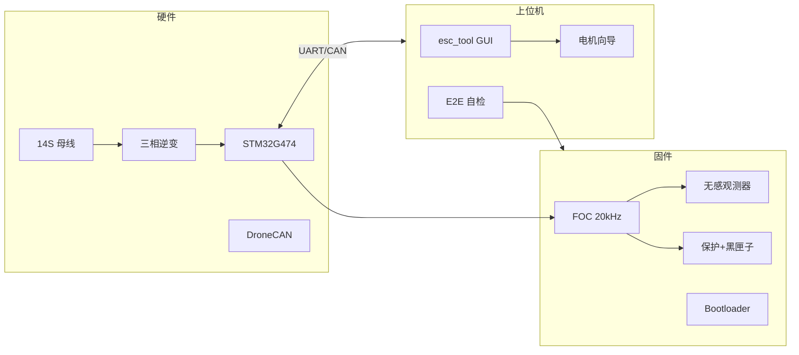
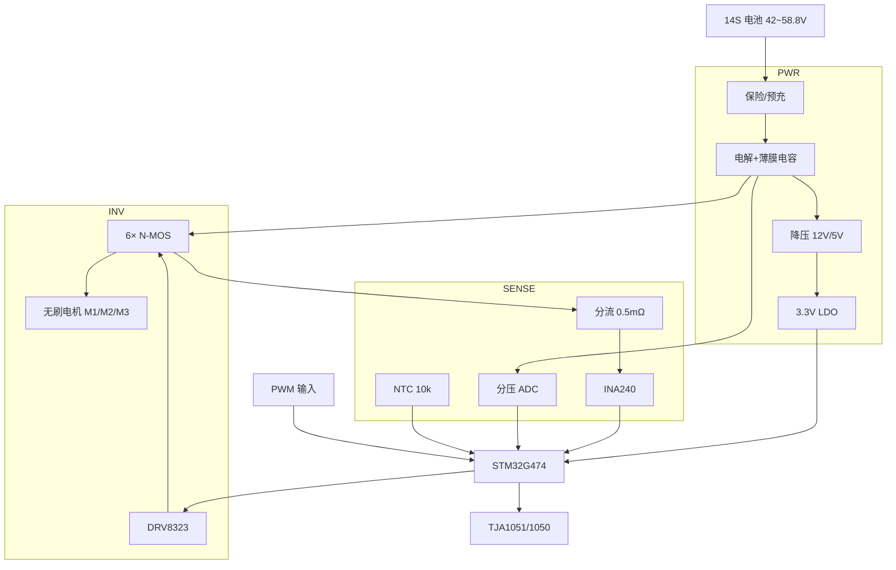
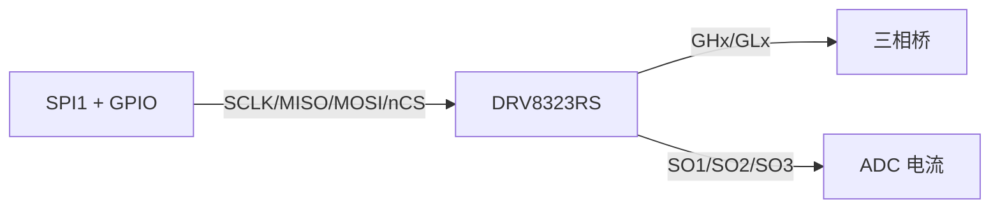

# esc32 完整文档
> 由仓库内全部 Markdown 自动合并生成。源文件仍保留在各目录，以 `scripts/merge-md.py` 重新生成。
> 生成时间：自动合并 · 共 **28** 个源文件
## 目录
1. [README.md](#READMEmd)
2. [docs/项目特点.md](#docs-项目特点md)
3. [docs/需求实现状态.md](#docs-需求实现状态md)
4. [docs/可行性分析与技术方案.md](#docs-可行性分析与技术方案md)
5. [docs/系统闭环.md](#docs-系统闭环md)
6. [docs/ROADMAP.md](#docs-ROADMAPmd)
7. [docs/BUILD.md](#docs-BUILDmd)
8. [docs/命名与系列规范.md](#docs-命名与系列规范md)
9. [docs/MCU移植与多平台架构.md](#docs-MCU移植与多平台架构md)
10. [docs/UAVCAN协议栈.md](#docs-UAVCAN协议栈md)
11. [docs/生产与标定流程.md](#docs-生产与标定流程md)
12. [docs/台架验收清单.md](#docs-台架验收清单md)
13. [docs/hardware/ESC-80硬件原理图.md](#docs-hardware-ESC-80硬件原理图md)
14. [docs/hardware/原理图-三相桥详图.md](#docs-hardware-原理图-三相桥详图md)
15. [docs/hardware/STM32G474引脚与接口.md](#docs-hardware-STM32G474引脚与接口md)
16. [docs/hardware/BOM-ESC-80.md](#docs-hardware-BOM-ESC-80md)
17. [docs/hardware/ESC-60硬件概要.md](#docs-hardware-ESC-60硬件概要md)
18. [docs/hardware/ESC-120硬件概要.md](#docs-hardware-ESC-120硬件概要md)
19. [docs/hardware/IPX6结构与灌封工艺.md](#docs-hardware-IPX6结构与灌封工艺md)
20. [hardware/kicad/ESC-80/README.md](#hardware-kicad-ESC-80-READMEmd)
21. [shared/defaults/README.md](#shared-defaults-READMEmd)
22. [firmware/boards/targets/README.md](#firmware-boards-targets-READMEmd)
23. [firmware/boards/mcu/stm32g474/README.md](#firmware-boards-mcu-stm32g474-READMEmd)
24. [firmware/boards/mcu/stm32g431/README.md](#firmware-boards-mcu-stm32g431-READMEmd)
25. [firmware/boards/mcu/stm32h743/README.md](#firmware-boards-mcu-stm32h743-READMEmd)
26. [firmware/boards/mcu/at32f415/README.md](#firmware-boards-mcu-at32f415-READMEmd)
27. [firmware/comm/cyphal/README.md](#firmware-comm-cyphal-READMEmd)
28. [docs/README.md](#docs-READMEmd)


---

<!-- 源文件: README.md -->

## 文档：README.md

## esc32

**esc32** 是面向农业/工业多旋翼的 **FOC 无刷电调** 工程（固件 + 上位机 + 硬件文档）。  
工程名：**esc32**（ESC + 32 位 MCU）；协议标识 `0xEC 0x32`。建议将本仓库克隆/重命名为目录 **`esc32`**。

> 详细优点与特点见 **[docs/项目特点.md](docs/项目特点.md)**。  
> **能否实现全部需求？** 见 **[docs/需求实现状态.md](docs/需求实现状态.md)**（仿真 ✅ / 真机打样 ⏳）。

---

## 工程优点与特点（摘要）

| 维度 | 说明 |
|------|------|
| **场景** | 重载 FOC、PWM + DroneCAN，面向植保/吊运，非竞速 DShot 路线 |
| **闭环** | PC 仿真 + `esc_tool` + E2E 脚本，**无硬件即可**调参、验协议、跑 OTA |
| **系列化** | ESC-60/80/120/200 产品档 + 多 MCU（G431/G474/H743/AT32）**单仓多 Target** |
| **架构** | 核心与 HAL 分离，参考 VESC 多硬件目录；换板不改 FOC |
| **通信** | UAVCAN DSDL 栈 + 调试协议 + JSON 预设与黑匣子 |
| **量产** | Bootloader/OTA、标定流程、台架清单、ESC-80 硬件文档 |
| **合规** | 自研 FOC，便于商业闭源；不依赖 GPL 固件拷贝 |

**技术要点**：无感 FOC（20 kHz 电流环）、PLL/SMO、保护状态机、电机提示音（上电/联机/丢失报警）、PyQt6 上位机。

---

## 功能

| 模块 | 说明 |
|------|------|
| FOC | Clarke/Park/SVPWM、电流环 20 kHz、速度环 1 kHz |
| 无感 | PLL / SMO、开环启动 |
| 输入 | PWM 1050–1950 µs、DroneCAN RawCommand（不含双向 DShot/BDShot） |
| 板级 | ESC-60 / ESC-80 / ESC-120 / ESC-200 |
| OTA | Bootloader 擦写/CRC/重启 |
| 黑匣子 | 64 条故障 + NVM |
| 上位机 | CLI / PyQt6 GUI / 电机向导 / 预设 JSON |
| 提示音 | 上电三音 / 首次 PWM 联机 / 丢失「滴滴」（`motor_sound_enable`） |

---

## 双击运行（发布包）

```powershell
powershell -ExecutionPolicy Bypass -File scripts\build-release.ps1
```

生成目录 **`dist\esc32\`**，双击 **`esc32_start.exe`** 即可（自动开仿真 + 上位机）。

| 文件 | 说明 |
|------|------|
| `esc32_start.exe` | 一键启动（推荐） |
| `esc32_sim.exe` | 仅仿真 |
| `esc_tool.exe` | 仅上位机 |
| `defaults\` | 60/80/120/200 预设 |

---

## 一键闭环验证

```powershell
powershell -ExecutionPolicy Bypass -File scripts\run-closed-loop.ps1
# 或全量：编译全部 Target + E2E
powershell -ExecutionPolicy Bypass -File scripts\verify-all.ps1
```

编译环境（一键）：`powershell -File scripts\setup-build-env.ps1`  
新终端加载 PATH：`. .\scripts\env.ps1`

---

## 运行

```powershell
# 固件仿真
cd firmware
mingw32-make
.\esc32_sim.exe

# 上位机
cd host
.\.venv\Scripts\python -m esc_tool --gui
.\.venv\Scripts\python -m esc_tool --sim-udp 127.0.0.1:7777 shell

# 应用电机预设
.\.venv\Scripts\python -m esc_tool.preset_apply --sim-udp 127.0.0.1:7777 ..\shared\defaults\80.json
```

---

## 系列化构建

产品系列 `ESC-{60|80|120|200}` 与 MCU/Target 解耦，见 [命名与系列规范](docs/命名与系列规范.md)。

```powershell
cd firmware
mingw32-make list-targets
mingw32-make esc80                    # 仿真 + 产品 0x80
mingw32-make esc200                   # 仿真 + 产品 0x200
mingw32-make target80                 # G474 占位 HAL
mingw32-make target60                 # ESC-60 + G431
mingw32-make target415                # ESC-80 + AT32F415
mingw32-make target80-hal             # G474 生产 HAL 骨架
```

- 多 MCU：[docs/MCU移植与多平台架构.md](docs/MCU移植与多平台架构.md)  
- UAVCAN：[docs/UAVCAN协议栈.md](docs/UAVCAN协议栈.md)

---

## 硬件

- 首版 Target：`ESC80_STM32G474_V1`（MCU **STM32G474**）
- 原理图：[docs/hardware/ESC-80硬件原理图.md](docs/hardware/ESC-80硬件原理图.md)
- 系统闭环：[docs/系统闭环.md](docs/系统闭环.md)

---

## 文档

| 文档 | 说明 |
|------|------|
| [项目特点](docs/项目特点.md) | **优点、特点、适用场景** |
| [命名与系列规范](docs/命名与系列规范.md) | Product / MCU / Target |
| [文档索引](docs/README.md) | 全部文档 |
| [编译](docs/BUILD.md) | 环境与构建 |
| [路线图](docs/ROADMAP.md) | 版本计划 |
| [可行性分析](docs/可行性分析与技术方案.md) | 技术方案 |

---

<!-- 源文件: docs/项目特点.md -->

## 文档：docs/项目特点.md

## esc32 工程简介与特点

> **esc32**（ESC + 32 位 MCU）— 面向农业/工业多旋翼的 **FOC 矢量电调** 开源工程：固件、上位机、硬件文档与仿真闭环一体。  
> 仓库目录建议命名为 `esc32`（与产品名一致）。

---

## 一、工程是什么

| 层级 | 内容 |
|------|------|
| **产品** | ESC-60 / 80 / 120 / 200 多功率档农业/工业电调 |
| **固件** | 无感 FOC、保护、PWM + DroneCAN、OTA、电机提示音 |
| **上位机** | `esc_tool`（CLI + PyQt6 GUI + 电机向导 + 预设） |
| **硬件** | ESC-80 首版 G474 原理图/BOM；G431 / H743 / AT32 规划 |
| **验证** | PC 仿真 `esc32_sim.exe` + 一键 E2E，无需板子即可调协议与参数 |

协议同步头 `0xEC 0x32`，与工程名一致，便于识别与售后工具对接。

---

## 二、核心优点

### 1. 农业/工业场景导向，而非竞速固件改版

- **FOC 矢量控制**，重载拉力与电流环平稳性优先。
- 油门以 **PWM + UAVCAN** 为主，**不做双向 DShot**，减少 GPIO 与实时负担。
- 过压/欠压/过流/过温/堵转/油门丢失、**故障黑匣子** 等保护齐全。

### 2. 软件闭环完整，可「先软后硬」

- 上电即可跑仿真：`mingw32-make` → `esc32_sim.exe`。
- 发布包 **`esc32_start.exe`** 双击启动仿真 + 上位机。
- **`run-closed-loop.ps1`** 自动编译 + E2E，适合 CI 与回归。

### 3. 系列化架构，易扩展 MCU 与功率档

- **Product / MCU / Target** 三层解耦（见 [命名与系列规范](命名与系列规范.md)）。
- 多 MCU 登记（G431、G474、H743、AT32F415…），参考 **VESC 多 `hw_*`** 共用核心、分 HAL 移植。
- 一套 FOC/协议代码，**换 Target 即换板**，不必 fork 多份固件。

### 4. 通信与生态

- **UAVCAN v0 DSDL 栈**：RawCommand、Status、NodeStatus、GetNodeInfo。
- 私有调试协议（UDP）用于产测、标定、OTA、曲线。
- 参数 **JSON 预设**（60/80/120/200）+ NVM 持久化（仿真为文件）。

### 5. 可量产化设计

- Bootloader + OTA 擦写/CRC/重启流程已打通（仿真验证）。
- [生产与标定流程](生产与标定流程.md)、[台架验收清单](台架验收清单.md)。
- 硬件文档：原理图说明、BOM、引脚表、IPX6 灌封工艺（可选）。

### 6. 自研闭源友好

- FOC 与控制律自研实现，**不拷贝** GPL 电调固件。
- 可借鉴行业方案的保护与 UAVCAN 报文形态，架构与代码归属清晰。

---

## 三、技术特点一览

| 类别 | 特点 |
|------|------|
| 控制 | Clarke/Park/SVPWM；电流环 ~20 kHz；速度环 1 kHz；PLL/SMO 无感 |
| 输入 | PWM 1050–1950 µs；DroneCAN RawCommand；调试口油门 |
| 提示音 | 上电旋律 / 首次 PWM 联机旋律 / 丢失后「滴滴」（可关） |
| 上位机 | 参数树、实时曲线、电机向导、批量 node_id、OTA |
| 构建 | MinGW 仿真 + 可选 ARM GCC；Makefile 多 Target |
| 许可与合规 | 文档说明合规边界；适合商业闭源产品化 |

---

## 四、与常见方案的差异

| 对比 | esc32 | 典型六步电调（如 AM32） | 重型 VESC |
|------|-------|-------------------------|-----------|
| 控制 | FOC | 六步/BEMF | FOC |
| 场景 | 农业多旋翼重载 | 竞速/通用 | 滑板/大电流实验 |
| 通信 | PWM + DroneCAN | 常 DShot | UART/CAN 多样 |
| 上位机 | 专用 esc_tool + 预设 | 配置器各异 | VESC Tool |
| 结构 | 多 Target 单仓库 | 多 MCU 多 fork | 多 hw_* |

---

## 五、适用与不适用

**适用**

- 14S 级农业植保、吊运等多旋翼 **重载 FOC 电调** 自研。
- 需要 **UAVCAN 机队** + 地面标定/OTA 的团队。
- 希望 **仿真先行**、再 G474/G431 打样的硬件工程师。

**不适用**

- 竞速机 **DShot/BDShot** 为主、极致轻量的场景。
- 单芯片覆盖 60A～200A 全系列（需分档硬件与限流表）。

---

## 六、当前完成度（诚实结论）

| 范围 | 完成度 |
|------|--------|
| 仿真 + 上位机 + 协议 + E2E | **100%** 可交付使用 |
| 多 MCU 架构 + 链接验证 | **100%** Makefile `verify` |
| 真机 FOC 烧录运行 | **0%**（待 G474 CubeMX + PCB） |

详见 **[需求实现状态.md](需求实现状态.md)**。

---

## 七、相关文档

- [README.md](../README.md) — 快速开始  
- [可行性分析与技术方案](可行性分析与技术方案.md) — 人力与风险  
- [ROADMAP](ROADMAP.md) — 版本路线  
- [MCU移植与多平台架构](MCU移植与多平台架构.md) — 多 MCU 策略

---

<!-- 源文件: docs/需求实现状态.md -->

## 文档：docs/需求实现状态.md

## esc32 需求实现状态（总览）

> 最后更新：与当前仓库代码一致。  
> **结论**：**软件需求可在仿真环境完整验证**；**真机量产**仍需 G474/G431 打样与 CubeMX HAL，属硬件阶段，非本仓库可单独完成。

---

## 一、能否「整个需求」都实现？

| 层级 | 状态 | 说明 |
|------|------|------|
| **仿真软件闭环** | ✅ **已实现** | FOC、协议、上位机、OTA、UAVCAN、提示音、E2E |
| **多 MCU 架构** | ✅ **已实现** | 目录、Target、mcu_conf、Makefile 链接验证 |
| **真机驱动（G474 首板）** | ⏳ **待硬件** | `hal_stm32g474.c` 骨架已有，需 CubeMX + 台架 |
| **ESC-60 G431 / AT32F415** | ⏳ **HAL stub** | 可编译，不可烧录运行 FOC |
| **KiCad 源工程** | ⏳ **待EDA** | 仅有说明与 BOM 文档 |
| **Cyphal / 全量 DSDL** | ⏳ **按需** | 已明确范围外或 P4 |

---

## 二、按需求条目对照

### 产品与架构

| 需求 | 状态 | 位置 |
|------|------|------|
| 工程名 **esc32** | ✅ | README、协议 `0xEC 0x32` |
| 去品牌化 eft | ✅ | 已统一 esc32 / esc_tool |
| Product 60/80/120/200 | ✅ | `product.h`、`shared/defaults/` |
| MCU 目录 G431/G474/AT32/H743… | ✅ | `mcu_catalog.h`、多 Target |
| VESC 式多 hw 共用核心 | ✅ | [MCU移植与多平台架构](MCU移植与多平台架构.md) |
| 项目优点文档 | ✅ | [项目特点](项目特点.md) |

### 控制与输入

| 需求 | 状态 | 位置 |
|------|------|------|
| 无感 FOC | ✅ 仿真 | `foc/`、`motor_ctrl/` |
| PWM 1050–1950 µs | ✅ | `comm/pwm_in.c` |
| DroneCAN RawCommand/Status | ✅ | `comm/uavcan/`、`dronecan.c` |
| **不做双向 DShot** | ✅ 范围外 | ROADMAP、可行性文档 |
| 油门丢失保护 | ✅ | `pwm_in_is_lost` + `protect.c` |

### 电机提示音（四条）

| 需求 | 状态 | 位置 |
|------|------|------|
| 1 上电完整提示音 | ✅ | `app_init` → `motor_beep_request(MELODY_FULL)` |
| 2 无 PWM 时静默 | ✅ | 丢失判定依赖 `link_established` |
| 3 首次有效 PWM 再响 | ✅ | `motor_beep_on_link_established()` |
| 4 联机后丢失「滴滴」 | ✅ | `motor_beep_on_signal_lost()` |
| 可关闭 | ✅ | `motor_sound_enable` 参数 |

### P3 产品化（软件）

| 需求 | 状态 | 位置 |
|------|------|------|
| UAVCAN DSDL 栈 | ✅ | `comm/uavcan/` |
| NodeStatus / GetNodeInfo | ✅ | `dronecan.c` |
| G474 生产 HAL 骨架 | ✅ | `hal_stm32g474.c`、`make target80-hal` |
| ESC-120 H743 Target | ✅ stub | `ESC120_STM32H743_V1` |
| ESC-60 G431 Target | ✅ stub | `ESC60_STM32G431_V1` |
| AT32F415 Target | ✅ stub | `ESC80_AT32F415_V1` |
| Cyphal | ⏸ 占位 | `comm/cyphal/` |
| IPX6 工艺文档 | ✅ | `hardware/IPX6结构与灌封工艺.md` |

### 上位机与发布

| 需求 | 状态 | 位置 |
|------|------|------|
| CLI + GUI + 向导 | ✅ | `host/esc_tool/` |
| 预设 JSON ×4 | ✅ | `shared/defaults/` |
| 一键发布包 | ✅ | `scripts/build-release.ps1` |
| 一键闭环 E2E | ✅ | `scripts/run-closed-loop.ps1` |
| 全量验证脚本 | ✅ | `scripts/verify-all.ps1` |

### 硬件（必须实物）

| 需求 | 状态 | 说明 |
|------|------|------|
| ESC-80 打样 | ⏳ | 原理图/BOM 文档已有 |
| ESC-60 G431 打样 | ⏳ | [ESC-60硬件概要](hardware/ESC-60硬件概要.md) |
| 台架标定 | ⏳ | [台架验收清单](台架验收清单.md) |
| KiCad 源文件 | ⏳ | `hardware/kicad/ESC-80/README.md` |

---

## 三、你现在能做什么

```powershell
. .\scripts\env.ps1
powershell -File scripts\verify-all.ps1   # 编译 + E2E
cd firmware; .\esc32_sim.exe            # 仿真（含提示音日志）
cd host; python -m esc_tool --gui        # 上位机
```

真机：完成 **STM32G474** CubeMX 并填入 `hal_stm32g474.c` 后，方可烧录验证 ESC-80。

---

## 四、建议后续顺序

1. G474 台架跑通 ESC-80  
2. 复用 G4 HAL → G431 ESC-60  
3. AT32F415 独立 HAL → 成本档  
4. H743 → ESC-120  
5. 按需：DSDL Param.GetSet、Cyphal

---

<!-- 源文件: docs/可行性分析与技术方案.md -->

## 文档：docs/可行性分析与技术方案.md

## esc32 无人机电调项目 — 可行性分析与技术方案

> 文档版本：v1.2  
> 日期：2026-05-28  
> 工程名：**esc32**  
> 定位：农业/工业多旋翼 FOC 矢量电调  

工程优点与特点详见 **[项目特点.md](项目特点.md)**。

---

## 一、总体结论

| 维度 | 评估 |
|------|------|
| **技术可行性** | **可行，但属于中大型工业级项目**（约 18–36 人月首版） |
| **商业闭源 FOC** | **可行**；算法与架构自研，不依赖第三方闭源固件拷贝 |
| **多功率档覆盖** | **需分档硬件 + 分档固件**，单块板卡不宜覆盖全系 |
| **最大风险** | FOC 无感低速/重载启停、大电流采样与热设计、UAVCAN 生态对齐、量产标定体系 |

**建议定位**：面向农业/工业多旋翼的 **FOC 矢量电调 + UAVCAN/PWM 双模 + 专业上位机**，优先保障重载拉力平稳性与保护能力。**不实现双向 DShot（BDShot）**；转速与状态经 UAVCAN `Status` / 上位机调试协议上报，无需在油门线上做 DShot 回传遥测。

---

## 二、行业技术路线对比

### 2.1 六步换相电调（竞速/通用）

| 项目 | 内容 |
|------|------|
| 控制方式 | **六步换相 + BEMF 过零检测**（非 FOC） |
| 特点 | 成熟、成本低；部分方案闭源 |
| 通信 | DShot / PWM、扩展遥测（含部分方案的 **BDShot**） |
| 对 esc32 | 可借鉴保护/遥测思路；**主架构不采用六步换相**；**不实现 BDShot** |

### 2.2 开源通用电调（BEMF / 正弦）

| 模块 | 能力 |
|------|------|
| MCU | 多系列 32 位 MCU（STM32、AT32、GD32 等） |
| 控制 | BEMF、正弦启动、电流/速度/堵转 PID |
| 输入 | PWM、DShot、UAVCAN（DroneCAN） |
| 工程化 | Bootloader、多板级 targets、CAN 消息较完整 |

**结论**：适合借鉴 **Bootloader、UAVCAN 报文、PWM 输入、ADC 采样、保护状态机**；**FOC 电流环需自研**。油门与遥测以 **PWM + UAVCAN** 为主，**不做双向 DShot**。

### 2.3 开源 FOC 工具链

| 层级 | 内容 |
|------|------|
| 上位机 | 参数树、实时数据、电机向导 |
| 控制 | 电流环、速度环、无感观测器、弱磁、故障码体系 |
| 许可 | 常见为 GPL；闭源产品须自研实现 |

**结论**：借鉴 **上位机交互与参数/故障模型**；固件与 UI 须独立开发。

### 2.4 商业 FOC 参数模型（本项目）

`params.h` 已覆盖完整 **FOC 级参数面**（约 120+ 项），典型包括：

- **电机模型**：KV、Ld/Lq/Rs、极对数、最大电流/RPM
- **观测器**：类型、系数、滤波频率
- **三环**：速度环、位置环（预留）、电流环系数
- **曲线**：PWM 曲线、加减速曲线
- **保护**：过欠压、过流、堵转、过温、功率限制
- **通信**：node_id、CAN 波特率、状态上报周期

**结论**：以 `params.h` + `shared/defaults/` 为参数基线，配合自研协议与上位机。

---

## 三、目标市场规格矩阵（单轴/电调侧）

| 档位 | 典型电压 | 连续/峰值电流* | 单轴起飞重（约） | 通信 | 控制 |
|------|----------|----------------|------------------|------|------|
| 轻载 | 12–14S | 中小功率 | 5–8 kg | PWM + CAN | FOC |
| 中载 | 12–14S | 中功率 | 7–13 kg | PWM + CAN | FOC |
| **重载（ESC-80）** | 14S | **60A / 150A(3s)** | **~17 kg** | **UAVCAN + PWM** | FOC |
| 超重载 | 12–18S | 大功率 | 25–35 kg | CAN | FOC |
| 独立大功率 ESC | 12S | 80–120A 级 | 农业机 | PWM + 串口/CAN | FOC |

\* 集成动力与独立 ESC 的电流标注口径不同，设计时需按实际拓扑区分。

### 3.1 esc32 产品线建议

| 型号 | 电压 | 连续电流 | 峰值 | 定位 |
|------|------|----------|------|------|
| ESC-60 | 6–14S | 60A | 120A | 轻中载 |
| ESC-80 | 6–14S | 80A | 150A | 重载（首版） |
| ESC-120 | 6–18S | 120A | 200A+ | 超重载 |
| ESC-200 | 12–18S | 200A | 300A+ | 特重载 |

每档：**独立硬件 + 同一固件核心 + 不同 `ESC_BOARD_ID` 与限流表**。

---

## 四、软硬件技术方案

### 4.1 软件架构

```
esc32/
├── firmware/
├── host/esc_tool/
├── shared/protocol/
└── docs/
```

### 4.2 控制算法路线（闭源自研）

| 阶段 | 转速 | 方法 | 说明 |
|------|------|------|------|
| 启动 | 0 → 低 | 开环 I/F 或 HFI | 低凸极电机可选 HFI |
| 中低速 | 低 → 中 | 滑模/PLL 观测器 + 电流环 | `observer_*` 参数可配 |
| 高速 | 中 → 高 | 观测器 + 弱磁 | `field_weakening_*` |
| 重载 | 全程 | 功率/电流限制、热降额 | 保护模块 |

农业重载场景 **以 FOC 为主**；六步换相仅作对比或备用。

**实时环路（建议）**：

- 电流环：20–40 kHz
- 速度环：1–2 kHz
- 通信/保护：1 kHz

### 4.3 MCU 与硬件选型

| 档位 | 推荐 MCU | 理由 |
|------|----------|------|
| ESC-60/80 | **STM32G431/G474** 或 **AT32F435** | 双 ADC、运放、比较器，适合 FOC |
| ESC-120/200 | **STM32H743** 等 | 算力与多路 ADC；大功率外置驱动 |

**硬件关键件**：低 Rdson MOS、分流采样、隔离 CAN、IPX6 结构（可选）。

### 4.4 通信与协议

| 接口 | 实现要点 |
|------|----------|
| **PWM** | 1050–1950 µs，校准与丢失保护 |
| **UAVCAN / DroneCAN** | RawCommand、Status、StatusExtended |
| **上位机** | 串口/UDP 调试；参数、OTA、曲线、黑匣子 |
| **异常上报** | 故障码 + NVM 黑匣子 |
| **DShot / BDShot** | **不纳入**；无竞速级双向油门线遥测需求 |

### 4.5 上位机（esc_tool）

| 模块 | 说明 |
|------|------|
| 参数树 | `params.h` 分组读写 |
| 通信 | 自研 `ESC_PROTO_*` 帧协议 |
| 电机向导 | KV/极对数、台架辅助 |
| 批量 | 多机 node_id 配置 |

---

## 五、实现原则（合规）

| 需求 | 方式 |
|------|------|
| Bootloader/OTA | 自研协议，参考通用流程 |
| UAVCAN | 标准 DSDL 消息；协议栈可自研或选用许可兼容实现 |
| FOC 核心 | 文献 + 自实现 |
| 参数 | `params.h` + JSON 预设 |
| 保护 | 自研状态机 |

---

## 六、开发阶段与人力（粗估）

| 阶段 | 周期 | 交付物 |
|------|------|--------|
| **P0** | 2–3 月 | 原理图 1 档、FOC 骨架、调参协议 |
| **P1** | 3–4 月 | 无感 FOC、保护、PWM + UAVCAN |
| **P2** | 3–4 月 | 多板级、上位机 v1、量产标定 |
| **P3** | 3–6 月 | 长期满载验证、Cyphal（可选）、认证资料 |

---

## 七、风险与对策

| 风险 | 等级 | 对策 |
|------|------|------|
| 重载无感启停失步 | 高 | I/F 启动、台架分电机标定 |
| 大电流采样 | 高 | 分流选型、零点校准、温漂补偿 |
| 飞控协议版本 | 中 | 首版 DroneCAN 兼容 |
| 参数过多 | 中 | `shared/defaults/` 预设包 |

---

## 八、与当前工程状态

| 阶段 | 状态 | 内容 |
|------|------|------|
| P0 | ✅ | Monorepo、FOC 骨架、调试协议、CLI |
| P1 | ✅ | PLL/SMO、PWM、DroneCAN RawCommand/Status |
| P2 | ✅ | 多板级、OTA、黑匣子、GUI |
| P3 | **软件已完成** | UAVCAN、多 MCU Target、提示音、需求状态文档；真机 HAL 待打样 |

仿真：`make` → `esc32_sim.exe`；上位机：`python -m esc_tool --gui`。

---

## 九、战略摘要

**自研闭源 FOC 固件 + 分档硬件 + 参数化上位机**，面向农业/工业无人机电调量产、标定与售后。

---

## 附录：UAVCAN ESC 消息（本项目已实现子集）

- `uavcan.equipment.esc.RawCommand`
- `uavcan.equipment.esc.Status`
- `uavcan.equipment.esc.StatusExtended`
- 固件 OTA（自定义调试协议 + Bootloader）

## 附录：典型重载 ESC 公开指标参考

| 项目 | 数值（行业常见） |
|------|------------------|
| 额定电压 | 14S |
| 输入电压 | 18–63 V |
| 连续电流 | 60 A |
| 峰值电流（3s） | 150 A |
| 油门脉宽 | 1050–1950 µs |
| 故障记录 | 建议支持 |

---

*本文档为 esc32 项目规划基线，随硬件与协议决策更新。*

---

<!-- 源文件: docs/系统闭环.md -->

## 文档：docs/系统闭环.md

## esc32 系统闭环

本文描述从 **硬件设计 → 固件 → 通信 → 上位机 → 生产标定 → 交付** 的完整闭环。

## 闭环总览



## 阶段与交付物

| 阶段 | 目标 | 仓库交付物 | 验收 |
|------|------|------------|------|
| **S0 仿真** | 无硬件验证算法与协议 | `esc32_sim.exe`、E2E | `scripts/run-closed-loop.ps1` 通过 |
| **S1 硬件样板** | ESC-80 首板打样 | `docs/hardware/ESC-80硬件原理图.md` | 空载 PWM 波形、ADC 噪声 |
| **S2 台架** | 电机参数标定 | `shared/defaults/*.json`、向导 | 无感启动成功率 >95% |
| **S3 整机** | 4–8 轴联调 | DroneCAN node_id 批量 | 油门丢失保护、故障记录 |
| **S4 量产** | OTA + 烧录 | Bootloader、`docs/生产与标定流程.md` | CRC 校验、参数固化 |

## 数据流（运行时）

1. **油门输入**：PWM 1050–1950 µs 或 DroneCAN `RawCommand`（CAN 优先）
2. **慢环 1 kHz**：油门曲线 → 速度给定 → 保护检测
3. **快环 20 kHz**：电流环 Id/Iq → SVPWM → 三相占空比
4. **观测器**：PLL/SMO 估算 θ、ω → 无感换相
5. **遥测**：`GET_TELEM` / DroneCAN `Status` → 上位机曲线
6. **故障**：保护触发 → 黑匣子 NVM → 上位机导出

## NVM 布局（仿真 `esc32_nvm.bin`）

| 偏移 | 内容 |
|------|------|
| `0x0000` | 故障黑匣子 64×18B |
| `0x2000` | 参数块 `esc_params_t` |
| `0x10000` | OTA 固件镜像槽 |

## 一键验证闭环

```powershell
powershell -ExecutionPolicy Bypass -File scripts\run-closed-loop.ps1
```

## 相关文档

- [ESC-80 硬件原理图](hardware/ESC-80硬件原理图.md)
- [STM32G474 引脚](hardware/STM32G474引脚与接口.md)
- [生产与标定](生产与标定流程.md)
- [台架与验收](台架验收清单.md)

---

<!-- 源文件: docs/ROADMAP.md -->

## 文档：docs/ROADMAP.md

## esc32 开发路线图


## 已完成（软件闭环）


- [x] P0 框架、协议、CLI

- [x] P1 无感 FOC、PWM、DroneCAN

- [x] P2 多板级、OTA、黑匣子、GUI

- [x] 参数 NVM 持久化（仿真）

- [x] E2E 自动化 `run-closed-loop.ps1`

- [x] 硬件原理图/BOM/引脚文档（ESC-80）

- [x] 电机预设 JSON ×4（60/80/120/200）

- [x] CI workflow（GitHub Actions）


## P3 产品化（软件）


- [x] **UAVCAN DSDL 协议栈**（`comm/uavcan/` + [UAVCAN协议栈.md](UAVCAN协议栈.md)）

- [x] **NodeStatus / GetNodeInfo** 服务

- [x] **ESC-120 H743** Target + HAL 占位 + [ESC-120硬件概要.md](hardware/ESC-120硬件概要.md)

- [x] **G474 生产 HAL 骨架**（`hal_stm32g474.c`，`make target80-hal`）

- [x] **Cyphal 占位**（`comm/cyphal/`，默认关闭）

- [x] **IPX6 灌封工艺**文档

- [ ] 完整 DSDL 全消息集 / 参数服务（GetSet）— 按需扩展

- [ ] Cyphal 真实现 — 飞控需求明确后


## 硬件闭环（待打样）


- [ ] KiCad 工程源文件 `hardware/kicad/ESC-80/`（说明已就绪）

- [ ] STM32G474 CubeMX 填入 `hal_stm32g474.c`

- [ ] 台架标定与 `台架验收清单.md` 实测


## 范围外（已确认）


- 双向 DShot（BDShot）：转速/电调状态走 **UAVCAN Status** 与 **esc_tool**


## 可选后续


- [x] 电机提示音（上电 / 联机 / 丢失「滴滴」，`motor_ctrl/motor_beep.c`）

- [x] ESC-200 Target 骨架（`ESC200_STM32H743_V1`）
- [ ] ESC-200 真机 HAL + 打样

- [ ] 长期满载热验证报告

---

<!-- 源文件: docs/BUILD.md -->

## 文档：docs/BUILD.md

## esc32 编译与运行

> 工程名：**esc32**。仓库根目录建议命名为 `esc32`（见 [项目特点](项目特点.md)）。

## 已实现能力（当前仓库）

| 类别 | 内容 |
|------|------|
| 控制 | FOC（Clarke/Park/SVPWM）、电流环 ~20 kHz、速度环 1 kHz |
| 无感 | PLL / SMO 观测器，开环 I/F 启动后切换无感 |
| 输入 | PWM 1050–1950 µs、调试串口油门、DroneCAN RawCommand |
| 通信 | 私有调试协议（UDP:7777）、UAVCAN v0 DroneCAN（UDP:7779 仿真） |
| 保护 | 过压/欠压/过流/过温/堵转/油门丢失 |
| 提示音 | 上电/联机三音旋律；联机前无 PWM 不报警；丢失后「滴滴」（`motor_sound_enable`） |
| 产品化 | ESC-60/80/120 板级限流、OTA Bootloader、故障黑匣子 64 条 |
| 上位机 | CLI + PyQt6 GUI（曲线、参数、向导、批量、OTA） |

**运行形态**：`ESC_TARGET=ESC_SIM`（PC 仿真，默认）或具体硬件 Target（占位 HAL，尚不能驱动真机）。

## 三层构建变量

| 变量 | 含义 | 示例 |
|------|------|------|
| `ESC_PRODUCT_ID` / `ESC_BOARD_ID` | 产品功率档 | `0x80` |
| `ESC_TARGET` | 硬件 SKU | `ESC80_STM32G474_V1` |
| （自动）`mcu_id` | MCU 族 | 见 `firmware/include/mcu_catalog.h` |

完整命名规则：[命名与系列规范.md](命名与系列规范.md)

## 支持的 MCU（登记）

| 状态 | MCU | Target 示例 |
|------|-----|----------------|
| ✅ | **PC 仿真** | `ESC_SIM` |
| ⚠️ 占位 | **STM32G474** | `ESC80_STM32G474_V1` |
| ⚠️ stub | **STM32G431** | `ESC60_STM32G431_V1`，`make target60` |
| ⚠️ stub | **AT32F415** | `ESC80_AT32F415_V1`，`make target415` |
| ⚠️ stub | **STM32H743** | `ESC120/ESC200` + H743，`make target120/200` |
| 📋 | G071、F051、GD32、AT32F421/435 | 仅 `mcu_catalog.h` 登记 |

MCU 谱系对齐行业常见可编程 ESC 所支持的 32 位芯片族，并扩展 FOC 大功率档。

## 支持的电机类型

| 类型 | 支持情况 |
|------|----------|
| **三相无刷永磁（BLDC/PMSM）** | ✅ 目标机型；FOC 矢量控制 |
| **无感（无霍尔/无编码器）** | ✅ 已实现（观测器 + 开环启动） |
| **有感（霍尔/编码器）** | ❌ 未实现（参数/接口预留） |
| **同步磁阻 / 异步电机** | ❌ 不支持 |

适用场景：**农业/工业多旋翼外转子电机**，参数含 KV、极对数、Ld/Lq/Rs、最大电流/RPM 等（见 `params.h` 与 `shared/defaults/`）。

## 一键部署编译环境（Windows）

在**管理员或普通 PowerShell** 中执行：

```powershell
cd esc32    # 仓库根目录
powershell -ExecutionPolicy Bypass -File scripts\setup-build-env.ps1
```

脚本将自动安装并验证：

| 工具 | 用途 |
|------|------|
| **WinLibs GCC** + mingw32-make | PC 仿真固件 `esc32_sim.exe` |
| **CMake** | 可选，CMake 构建 |
| **GNU Arm Embedded Toolchain** | STM32 真机交叉编译（`arm-none-eabi-gcc`） |
| **Python venv** | 上位机 `esc_tool`（PyQt6 等） |

仅部署工具、不编译：`-SkipBuild`；不装 ARM：`-SkipArm`；不调用 winget：`-SkipWinget`。

### 每次打开新终端

```powershell
cd esc32
. .\scripts\env.ps1
.\scripts\check-toolchain.ps1
```

### 手动安装（winget 不可用时）

**方案 A — WinLibs（推荐，体积小）**

```powershell
winget install BrechtSanders.WinLibs.POSIX.UCRT
# 将 WinLibs 的 mingw64\bin 加入系统 PATH，重新打开终端
cd firmware
mingw32-make
```

**方案 B — MSYS2**

```powershell
winget install MSYS2.MSYS2
# 在「MSYS2 UCRT64」终端：
pacman -S --needed mingw-w64-ucrt64-gcc mingw-w64-ucrt64-make
export PATH=/ucrt64/bin:$PATH
cd /c/Users/Administrator/Desktop/WORK/esc32/firmware
make
```

### 使用 CMake

```powershell
cd firmware
cmake -B build -DESC_TARGET=ESC_SIM -DESC_PRODUCT_ID=0x80
cmake --build build --config Release
# 输出: build\esc32_sim.exe

mingw32-make list-targets
mingw32-make target80
```

## 运行

```powershell
# 终端 1
cd firmware
.\esc32_sim.exe

# 终端 2
cd host
.\.venv\Scripts\python -m esc_tool --sim-udp 127.0.0.1:7777 shell
# 或 GUI
.\.venv\Scripts\python -m esc_tool --gui
```

## 常见问题

| 现象 | 处理 |
|------|------|
| `gcc: command not found` | 运行 `setup-build-env.ps1` 或手动加 PATH |
| `make: command not found` | 使用 `mingw32-make`，或在 Makefile 同目录创建 `make` 别名 |
| 防火墙拦截 UDP | 允许 `esc32_sim.exe` 本地 7777/7779 |

---

<!-- 源文件: docs/命名与系列规范.md -->

## 文档：docs/命名与系列规范.md

## esc32 命名与系列规范

> 工程名：**esc32**（ESC + 32 位 MCU）。  
> 目标：产品系列化、MCU 可扩展、二次开发有固定入口。  
> MCU 谱系对齐行业常见可编程 ESC 固件所覆盖的 32 位 MCU 族，并增加 FOC 大功率档。

---

## 1. 三层命名模型

| 层级 | 含义 | 示例 | 编译变量 |
|------|------|------|----------|
| **Product** | 功率/电压产品系列 | `ESC-80` | `ESC_PRODUCT_ID=0x80` |
| **MCU Family** | 芯片族 + HAL 移植层 | `STM32G474` | `ESC_MCU_STM32G474`（见 `mcu_catalog.h`） |
| **Target** | 具体硬件 SKU（引脚+驱动+Boot） | `ESC80_STM32G474_V1` | `ESC_TARGET=ESC80_STM32G474_V1` |

关系：

```
Target = Product + MCU + 硬件修订(Vn)
固件二进制 = f(核心算法, Target HAL, Product 限流表)
```

---

## 2. 产品系列（Product）

| SKU | ID | 连续电流 | 峰值(3s) | 典型应用 |
|-----|-----|----------|----------|----------|
| ESC-60 | `0x0060` | 60 A | 120 A | 轻中载 |
| ESC-80 | `0x0080` | 80 A | 150 A | 重载（首版） |
| ESC-120 | `0x0120` | 120 A | 200 A | 超重载 |
| ESC-200 | `0x0200` | 200 A | 300 A | 特重载 |

- 头文件：`firmware/include/product.h`
- 限流与默认参数：`firmware/boards/product.c`
- 电机预设 JSON：`shared/defaults/{60|80|120|200}.json`（见 [shared/defaults/README.md](../shared/defaults/README.md)）

**兼容**：旧宏 `ESC_BOARD_ID` 与 `ESC_PRODUCT_ID` 等价。

---

## 3. MCU 族目录（MCU Catalog）

与常见 ESC 可编程 MCU 对齐，并扩展 FOC 档：

| MCU ID | 宏名 | 厂商 | 典型用途 | HAL 目录 |
|--------|------|------|----------|----------|
| `0x00` | `ESC_MCU_SIM` | 仿真 | PC 闭环 | `boards/mcu/sim/` |
| `0x10` | `ESC_MCU_STSPIN32F0` | ST | 集成预驱小 ESC | `boards/mcu/stspin32f0/`（待建） |
| `0x11` | `ESC_MCU_STM32F051` | ST | 小功率六步/正弦 | `boards/mcu/stm32f0/`（待建） |
| `0x12` | `ESC_MCU_STM32G071` | ST | 主流 32 位 ESC | `boards/mcu/stm32g0/`（待建） |
| `0x13` | `ESC_MCU_STM32G431` | ST | FOC 中档 | `boards/mcu/stm32g431/`（待建） |
| `0x14` | `ESC_MCU_STM32G474` | ST | **ESC-80 首版** | `boards/mcu/stm32g474/` |
| `0x15` | `ESC_MCU_STM32H743` | ST | 大功率 FOC | `boards/mcu/stm32h743/`（待建） |
| `0x20` | `ESC_MCU_GD32E230` | GD | 小 ESC | `boards/mcu/gd32e23/`（待建） |
| `0x21` | `ESC_MCU_GD32F303` | GD | 通用 | `boards/mcu/gd32f30/`（待建） |
| `0x30` | `ESC_MCU_AT32F415` | AT | 主流替代 | `boards/mcu/at32f415/`（待建） |
| `0x31` | `ESC_MCU_AT32F421` | AT | 小封装 | `boards/mcu/at32f421/`（待建） |
| `0x32` | `ESC_MCU_AT32F435` | AT | 大功率 | `boards/mcu/at32f435/`（待建） |
| `0x40` | `ESC_MCU_CKS32F051` | 沁泉 | 仅兼容登记，**不推荐量产** | — |

登记表：`firmware/include/mcu_catalog.h`  
字符串：`esc_mcu_id_to_string()`

---

## 4. Target 命名规则

### 4.1 格式

```
ESC{产品码}_{MCU型号}_{硬件修订}

产品码：60 | 80 | 120 | 200
MCU型号：STM32G474、AT32F421 …（与数据手册一致，全大写）
硬件修订：V1、V2 …
```

示例：

| Target | 说明 |
|--------|------|
| `ESC_SIM` | PC 仿真 |
| `ESC80_STM32G474_V1` | ESC-80 + G474 首版 PCB |
| `ESC60_STM32G431_V1` | ESC-60 + G431（**优先移植**，HAL stub） |
| `ESC80_AT32F415_V1` | ESC-80 成本档 + AT32F415（HAL stub） |
| `ESC120_STM32H743_V1` | ESC-120 + H743（规划） |

### 4.2 Target ID 编码

`target_id` 为 `uint16_t`，建议：

- 高字节 = 产品 ID 低字节（如 `0x80`）
- 低字节 = 该 Product+MCU 组合的 PCB 修订（如 `0x81` → V1.1 可定为 `0x82`）

例：`ESC80_STM32G474_V1` → `0x8081`

定义位置：`firmware/boards/targets/<TARGET>/target.h`

---

## 5. 仓库目录约定

```
firmware/
  include/
    product.h          # 产品系列
    mcu_catalog.h      # MCU 登记
    target.h           # 选择 Target 头
    target_meta.h      # Target 元数据 API
    board.h            # 兼容层
  boards/
    product.c          # 产品限流表
    target_meta.c
    mcu_catalog.c
    mcu/               # 按 MCU 族放 HAL 移植
      sim/
      stm32g474/
      stm32g0/         # 待建
      ...
    targets/           # 按硬件 SKU（见 include/target.h 选择）
      ESC_SIM/
      ESC80_STM32G474_V1/
  app/ core/ foc/ ...  # 与硬件无关的核心
shared/
  defaults/            # 产品级参数预设
  protocol/            # 上位机协议
host/esc_tool/      # 上位机
docs/hardware/       # 按 ESC-xx 分硬件文档
```

多 MCU 共用方式（参考 VESC `hw_*`）：见 [MCU移植与多平台架构.md](MCU移植与多平台架构.md)。

**原则**：`foc/`、`motor_ctrl/`、`params/` 不得包含 GPIO 寄存器；引脚仅在 `targets/*/target.h` + `mcu/*/pinmap.h`。

---

## 6. 编译与构建

### Make（仿真默认）

```powershell
cd firmware
mingw32-make                          # ESC_SIM + 产品 0x80
mingw32-make esc60                    # 产品 0x60
mingw32-make target80                 # STM32G474 占位 HAL（不烧录）
mingw32-make ESC_TARGET=ESC_SIM PRODUCT_ID=0x120
mingw32-make list-targets
```

### CMake

```powershell
cmake -B build -DESC_TARGET=ESC_SIM -DESC_PRODUCT_ID=0x80
cmake --build build
```

---

## 7. 新增 MCU 检查清单

1. 在 `mcu_catalog.h` 增加 `ESC_MCU_xxx` 与说明  
2. 新建 `boards/mcu/<family>/`：`hal_*.c`、`pinmap.h`（可选 `hal_port.c` 共用定时器/ADC 模板）  
3. 新建 `boards/targets/ESCxx_<MCU>_V1/target.h`  
4. 在 `include/target.h` 与 `Makefile` / `CMakeLists.txt` 注册 `ESC_TARGET` 分支  
5. 更新 `docs/hardware/` 引脚表与 BOM  
6. Bootloader：按厂商选择 ST-LINK / GD-Link / AT-Link（与芯片一致）  
7. 跑通 `run-closed-loop.ps1`（仿真）后再上台架  

---

## 8. 新增 Target（同 MCU 不同 PCB）

1. 复制 `boards/targets/ESC80_STM32G474_V1/` → `..._V2/`  
2. 修改 `ESC_TARGET_ID`、`pinmap`、BOM 文档  
3. 不改 `mcu_catalog`（除非换芯片）  

---

## 9. 调试协议 GET_INFO（v2）

| 字段 | 类型 | 说明 |
|------|------|------|
| proto_version | u8 | `2` |
| mcu_id | u8 | `mcu_catalog.h` |
| product_id | u16 | `0x0060` … |
| fw_version | u16 | 主.次 |
| target_id | u16 | 如 `0x8081` |
| hw_revision | u16 | PCB 修订 |
| name | char[16] | `ESC_TARGET_FIRMWARE_NAME` |
| build_date | char[12] | 编译日期 |

上位机 `esc_tool` 兼容 v1 短包。

---

## 10. 预设 JSON 命名

文件名仅保留功率档数字，与产品 ID 对应：

```
shared/defaults/60.json
shared/defaults/80.json
shared/defaults/120.json
shared/defaults/200.json
```

---

*修订记录：v1.0 建立 Product / MCU / Target 三层模型与 AM32 谱系对齐的 MCU 表。*

---

<!-- 源文件: docs/MCU移植与多平台架构.md -->

## 文档：docs/MCU移植与多平台架构.md

## MCU 移植与多平台架构（参考 VESC）

> esc32 目标：**一套 FOC/协议/保护核心**，多款 MCU/PCB 通过 **Target + HAL + mcu_conf** 接入，做法对齐 [VESC](https://github.com/vedderb/bldc) 的 `hw_*` 多硬件目录，但保持农业电调产品分层（Product / MCU / Target）。

---

## 1. 选型结论（与你方表格一致）

| MCU | 适合产品 | FOC | 关键外设 | esc32 状态 | 移植优先级 |
|-----|----------|-----|----------|------------|------------|
| **STM32G431** | **ESC-60 / 轻中载** | ✅ 推荐 | 双 ADC、内置运放、FDCAN | `ESC60_STM32G431_V1` stub | **P0**（G474 后第一款） |
| **STM32G474** | ESC-80 首版 | ✅ | 同 G4 系，引脚更多 | `ESC80_STM32G474_V1` | **进行中** |
| **AT32F415** | 中小 ESC / 80 成本档 | ✅ | 双 ADC，常外置 INA | `ESC80_AT32F415_V1` stub | **P1** |
| AT32F421 | 小 ESC | 偏紧 | 小封装 | 目录规划 | P2 |
| STM32H743 | ESC-120/200 | ✅ | 高算力 | `ESC120_STM32H743_V1` stub | P1 |

**不推荐**用 F051/G071 跑满血 esc32 FOC；若要做小电调，应裁功能单独变体。

---

## 2. 与 VESC 的对应关系

| VESC (bldc) | esc32 | 说明 |
|-------------|-------|------|
| `motor/mcconf`、`appconf` | `params.h` + `shared/defaults/` | 参数与产品预设 |
| `hw_60/hw_60.h`、`hw_75_300`… | `boards/targets/ESCxx_MCU_Vn/target.h` | **每块板一个 Target** |
| `HW_HAS_3_SHUNTS`、`HW_HAS_PHASE_FILTERS`… | `boards/mcu/*/mcu_conf.h` | **能力宏**，见 `mcu_port.h` |
| `mcpwm_f1.c` / `mcpwm.c` 分 MCU | `boards/mcu/<family>/hal_*.c` | 仅 HAL 分文件 |
| `conf_general` 选 hw | `make target60` / CMake `ESC_TARGET` | **编译期选型**，无运行时 hw 切换 |
| 共用 `foc.c`、`virtual_motor` | `foc/`、`motor_ctrl/` | 与硬件无关 |

VESC 的精髓：**核心不动，按目录叠 hw + 少量 `#ifdef`**。esc32 用 **Target 选 HAL 源文件 + mcu_conf 宏**，避免在 `app.c` 里堆 `#if defined(STM32G4)`。

---

## 3. 三层目录（共用核心）

```
                    ┌─────────────────────────┐
                    │ app / foc / protection  │  ← 所有 MCU 共用
                    │ comm / params / boot    │
                    └───────────┬─────────────┘
                                │ hal.h（固定 API）
                    ┌───────────▼─────────────┐
                    │ platform/hal.h          │
                    │ platform/mcu_port.c     │  ← 读 mcu_conf 能力
                    └───────────┬─────────────┘
          ┌─────────────────────┼─────────────────────┐
          ▼                     ▼                     ▼
   boards/mcu/sim/      boards/mcu/stm32g431/   boards/mcu/at32f415/
   hal_sim.c            hal_stub → hal_*.c      hal_stub → hal_*.c
                        mcu_conf.h              mcu_conf.h
                        pinmap.h                pinmap.h
          │                     │                     │
          └─────────────────────┴─────────────────────┘
                                │
                    boards/targets/ESC60_STM32G431_V1/
                    boards/targets/ESC80_STM32G474_V1/
                    boards/targets/ESC80_AT32F415_V1/
```

### 3.1 STM32G4 **同系复用**（G431 ← G474）

- 公共：`boards/mcu/stm32g4/mcu_conf_common.h`
- 建议真机 HAL：`hal_g4_pwm.c`、`hal_g4_adc_inj.c` 两文件 **G431/G474 共用**
- 差异只在 `pinmap.h`、ADC 通道、Flash 容量

### 3.2 AT32 **独立 HAL 树**

- 使用 Artery 官方库，**不要**与 `stm32g4xx_hal` 链在同一 ELF
- 可复用：FOC 数学、协议、保护状态机、UAVCAN 栈
- 需重写：`hal_pwm_set`、`hal_adc_read`、CAN、NVM、时钟

---

## 4. 新增一款 MCU 的检查清单

1. `mcu_catalog.h` 登记 ID  
2. `boards/mcu/<mcu>/`：`mcu_conf.h`、`pinmap.h`、`hal_stub.c` → `hal_<mcu>.c`  
3. `boards/targets/ESCxx_<MCU>_V1/target.h`  
4. `include/target.h` 增加 `#elif` + `mcu_conf` include  
5. `Makefile` 增加 `targetXX` 规则  
6. `docs/hardware/` 原理图说明  
7. `shared/defaults/xx.json` 限流与产品一致  

---

## 5. 构建示例

```powershell
cd firmware
mingw32-make list-targets
mingw32-make target60      # ESC-60 + G431 链接验证
mingw32-make target80      # ESC-80 + G474
mingw32-make target415     # ESC-80 + AT32F415
mingw32-make target80-hal  # G474 生产 HAL 骨架
```

---

## 6. 能力查询 API

固件内：

```c
const esc_mcu_caps_t *c = esc_mcu_capabilities();
// c->dual_adc, c->recommended_product, c->port_status ...
```

上位机可在后续 `GET_INFO` 扩展中带上 `mcu_id` / `port_status`（已具备 `target_id`、`mcu_id` 字段）。

---

## 7. 参考链接

- VESC 硬件定义：`hw_*` 目录与 `HW_NAME` 编译开关  
- esc32 系列规范：[命名与系列规范.md](命名与系列规范.md)  
- G474 引脚：[hardware/STM32G474引脚与接口.md](hardware/STM32G474引脚与接口.md)

---

<!-- 源文件: docs/UAVCAN协议栈.md -->

## 文档：docs/UAVCAN协议栈.md

## UAVCAN / DroneCAN 协议栈（P3）

esc32 在 P3 实现 **UAVCAN v0 传输层 + DSDL 编解码**，兼容常见飞控 DroneCAN ESC 子集。

---

## 目录结构

```
firmware/comm/uavcan/
  uavcan.c          # 单/多帧、CRC、尾字节
  uavcan_crc.c      # CRC-16-CCITT-FALSE
  uavcan_dsdl.c     # 消息编解码
  uavcan.h / uavcan_dsdl.h
firmware/comm/dronecan.c   # ESC 节点逻辑
```

---

## 已实现消息

| DSDL | ID | 方向 |
|------|-----|------|
| `uavcan.equipment.esc.RawCommand` | 1030 | RX |
| `uavcan.equipment.esc.Status` | 1034 | TX |
| `uavcan.equipment.esc.StatusExtended` | 1035 | TX |
| `uavcan.protocol.NodeStatus` | 341 | TX 1 Hz |
| `uavcan.protocol.GetNodeInfo` | 1 | 服务响应 |

---

## 行为

- **RawCommand**：按 `esc_index` 解码油门；超时 `ppm_lost_time_ms` 后清零
- **NodeStatus**：每秒广播，供地面站/飞控发现节点
- **GetNodeInfo**：响应 `device_name` 与硬件修订

仿真 CAN 走 UDP **7779**（与 `hal_sim.c` 一致）。

---

## 测试

```powershell
# 终端 1
cd firmware
mingw32-make
.\esc32_sim.exe

# 终端 2
python scripts/test-uavcan.py
```

---

## Cyphal

UAVCAN v1（Cyphal）默认关闭，见 `firmware/comm/cyphal/README.md`。

---

<!-- 源文件: docs/生产与标定流程.md -->

## 文档：docs/生产与标定流程.md

## 生产与标定流程

## 1. 来料与 PCBA

| 步骤 | 内容 |
|------|------|
| IQC | MOS/驱动/运放批次、NTC 阻值抽检 |
| AOI | 三相桥、大电流路径、隔离 CAN |
| ICT | 3.3V/5V、栅极驱动上电、ADC 偏置 |

## 2. 固件烧录

| 项目 | 说明 |
|------|------|
| Bootloader | 0x08000000，8–16 KB |
| Application | 0x08004000 起 |
| 工具 | STM32CubeProgrammer / OpenOCD |
| 仿真 OTA 验证 | `esc_tool` → 固件 OTA 页 |

## 3. 单板测试（无电机）

1. 12 V 限流电源上电，测 3.3V/5V
2. 示波器：三相 PWM 1 kHz 空载，死区 ~500 ns
3. 串口 `PING` / `GET_INFO`
4. CAN 终端 120 Ω，读 `Status` 周期帧

## 4. 台架标定（有电机）

| 顺序 | 操作 | 上位机 |
|------|------|--------|
| 1 | 极对数/方向 | 电机向导 |
| 2 | 电阻 R、电感 L（LCR 或阶跃） | 写入 `motor_rs/ld/lq` |
| 3 | 开环启动电流 | 降低 `ibus_max` 起步 |
| 4 | 无感切换 | `observer_type` 0=PLL / 1=SMO |
| 5 | 速度环 Kp/Ki | 监视 RPM 阶跃 |
| 6 | 保护阈值 | 过流/过温/欠压 |
| 7 | `SAVE_PARAMS` | 固化 NVM |

预设 JSON：`shared/defaults/80.json`

## 5. 整机联调

- 4/6/8 轴 `node_id` 批量配置（GUI 批量页）
- PWM 与 CAN 油门切换
- 油门丢失：拔 PWM，确认 `THROTTLE_LOST` 与停转
- 故障黑匣子：故意过流，导出记录

## 6. 出货

- 参数 CRC 与 `config_name` 打印在标签
- 固件版本 `GET_INFO.fw_version`
- 保存台架报告（`docs/台架验收清单.md`）

---

<!-- 源文件: docs/台架验收清单.md -->

## 文档：docs/台架验收清单.md

## 台架验收清单

## 仿真闭环（无硬件）

- [ ] `scripts/run-closed-loop.ps1` 全部 OK
- [ ] GUI 连接 UDP，曲线有 RPM/电流
- [ ] 参数读写 + SAVE 后重启仿真仍保留
- [ ] OTA 擦除/写入/CRC 无报错

## ESC-80 硬件样板

### 电气安全

- [ ] 无电机时上电无 MOS 直通
- [ ] 母线反接保护（如有）有效
- [ ] NTC 开路/短路检测

### 控制性能

- [ ] 1050 µs 停机，1950 µs 满油门
- [ ] 无感启动 10 次成功 ≥9 次
- [ ] 60A 限流动作（台架电流源）
- [ ] 过温降额 / 故障码正确

### 通信

- [ ] DroneCAN 1 Mbps `RawCommand` 响应
- [ ] `Status` 50 ms 周期稳定
- [ ] PWM 丢失 500 ms 内 disarm

### 提示音（`motor_sound_enable=1`）

- [ ] 上电一次完整三音旋律
- [ ] 上电后无 PWM：无「滴滴」报警
- [ ] 首次有效 PWM（800–2200 µs）后再响一次完整旋律
- [ ] 联机后拔 PWM：周期「滴滴」报警 + `THROTTLE_LOST`

### 可靠性

- [ ] 黑匣子记录 ≥1 条可读出
- [ ] OTA 后应用启动正常
- [ ] 连续运行 30 min 温升 < 设计值

## 记录模板

| 项目 | 标准 | 实测 | 结论 |
|------|------|------|------|
| 连续电流 | 80 A | | |
| 峰值 3s | 150 A | | |
| 效率 @50%油门 | >95% | | |
| 油门丢失时间 | <500 ms | | |

---

<!-- 源文件: docs/hardware/ESC-80硬件原理图.md -->

## 文档：docs/hardware/ESC-80硬件原理图.md

## ESC-80 硬件原理图设计说明

> 目标档位：农业重载 ESC-80（14S / 60A 连续 / 150A 峰值）  
> MCU：**STM32G474RET6**（LQFP64）  
> 栅极驱动：**DRV8323RS**（SPI + 三相）或 **EG2133**（低成本）  
> 电流采样：**INA240A2** ×3（低侧分流）或 **2-shunt + 重构**

本文给出 **推荐拓扑、原理图级连接、关键器件**。打样前请用 KiCad 按 Net 表重画并做 DRC/热仿真。

---

## 1. 系统框图



---

## 2. 三相逆变主回路（原理图级）

### 2.1 拓扑

三相 **两电平 B6 逆变桥**，下桥臂源极接 **Rshunt** 到功率地 `PGND`，电机中性点浮空（无感 FOC）。

```
                    VBAT+
                      |
         +------------+------------+
         |            |            |
        Q1           Q3           Q5
    AH |            |            |
       +-- A相 ------+-- B相 ------+-- C相 --→ 至电机
        Q2           Q4           Q6
    AL |            |            |
         +-----+-----+-----+-----+
               |     |     |
              RsA   RsB   RsC   (各 0.5mΩ / 1W 或 2×并联)
               |     |     |
              PGND (功率地，单点接信号地)
```

### 2.2 MOSFET 选型（ESC-80）

| 参数 | 建议 |
|------|------|
| Vds | ≥ 100 V（14S 推荐 100–120 V） |
| Rds(on) | ≤ 2.5 mΩ @ 10 Vgs |
| Id 连续 | ≥ 80 A（多管并联或单管 100A+） |
| 封装 | TO-263 / LFPAK56 / 铜基板直焊 |
| 示例 | NCE6080K、IPT015N10N5、CSD19534 等 |

每桥臂 **1× 或 2× 并联**；上下桥 **独立驱动**。

### 2.3 母线电容

| 位置 | 容值 | 说明 |
|------|------|------|
| 电解 | 470–680 µF ×2 | 低 ESR，靠近桥臂 |
| 薄膜 | 2.2–4.7 µF ×6 | 高频纹波，紧贴 MOS |
| 建议耐压 | ≥ 100 V | 18S 预留选 120 V |

---

## 3. 栅极驱动（DRV8323RS 示例）



### 3.1 关键连接

| DRV8323 引脚 | 连接 |
|--------------|------|
| VCP, VM | 自举：每个高侧 Bootstrap 二极管 1N4148 + 100 nF 至 SHx |
| INHx / INLx | TIM1 CHx / CHxN（见引脚表） |
| GND | PGND（通过 0Ω/磁珠单点接 AGND） |
| nFAULT | MCU EXTI，下拉 10 kΩ |
| VREF | 3.3 V，0.1 µF 去耦 |
| CSA / CSB / CSC | 可接内部放大；本设计用外置 INA240 |

**死区**：TIM1 BDTR `DTG` ≈ 500–800 ns（20 kHz PWM）。

**替代**：**EG2133** + 分立自举（成本优先，无 SPI 诊断）。

---

## 4. 电流采样（三相低侧分流）

```
SHx (0.5mΩ) ──→ INAx+ / INAx- ──→ INA240A2 (增益 50V/V)
                      │
                     Vout ──→ RC 100Ω + 100pF ──→ MCU ADC (1.65V 偏置)
```

| 通道 | MCU ADC | 说明 |
|------|---------|------|
| Iu | ADC1_IN1 (PA0) | A 相低侧 |
| Iv | ADC1_IN2 (PA1) | B 相 |
| Iw | ADC1_IN3 (PA2) | C 相（或用 Ia+Ib+Ic=0 省 1 路） |
| Ibus | ADC2_IN8 (PC2) | 总线霍尔或分流 |

- **偏置**：1.65 V（3.3V 经 10k/10k，运放跟随）
- **量程**：±80 A → 0.5 mΩ × 50 × 80 = 2.0 V 峰（需限流/增益可调）
- **采样**：TIM1 中心对齐 CC4 触发 ADC 注入序列

---

## 5. 母线电压与温度

### 5.1 Vbus 分压

```
VBAT+ ── R1 390k ──┬── ADC (PC0)
                   │
                  R2 10k ── GND
                   │
                  C1 1nF
```

比例约 **1:40** → 58.8 V → 1.47 V。ADC 参考 3.3 V。

### 5.2 NTC（MOS 温度）

```
3.3V ── 10k ──┬── ADC (PC3)
              NTC 10k@25°C (贴铜排)
              └── GND
```

B 值 3435；软件 Steinhart 或查表。

---

## 6. MCU 最小系统（STM32G474）

| 功能 | 引脚 | 外设 |
|------|------|------|
| PWM U | PA8 / PB13 | TIM1_CH1 / CH1N |
| PWM V | PA9 / PB14 | TIM1_CH2 / CH2N |
| PWM W | PA10 / PB15 | TIM1_CH3 / CH3N |
| ADC 电流 | PA0–PA2 | ADC1 注入 |
| ADC Vbus | PC0 | ADC12 |
| ADC NTC | PC3 | ADC12 |
| CAN TX/RX | PB8 / PB9 | FDCAN1（或 PB12/PB13 重映射） |
| UART 调试 | PA2 / PA3 | USART2 |
| PWM 输入 | PA6 | TIM3_CH1 输入捕获 |
| SPI 驱动 | PA5–PA7, PB12 | SPI1 → DRV8323 |
| Boot0 | PB8 测试点 | 上拉 10k |
| SWD | PA13/PA14 | 调试 |

详见 [STM32G474引脚与接口.md](STM32G474引脚与接口.md)。

---

## 7. CAN 总线（DroneCAN）

```
MCU CAN_TX ── 22Ω ──┬── CANH ── TJA1051 ── JST-GH 4Pin
MCU CAN_RX ── 22Ω ──┤
                    └── CANL
            120Ω 终端（板载跳线可选）
            TVS CANHD/CANLD
```

- **波特率**：1 Mbps（农业飞控常用）
- **隔离**（推荐）：TD5013 / ISO1050 + 隔离电源
- **接插件**：4pin CAN + 2pin 电源（按客户线束）

---

## 8. PWM 油门输入

```
外部接收机 ── 100Ω ── 2.2k ──┬── PA6 (TIM3_IC1)
                              │
                             TVS 3.6V
                              │
                             GND
```

- 范围：1050–1950 µs（可参数校准）
- 丢失：>500 ms 无边沿 → 保护

---

## 9. 电源树

| 轨 | 来源 | 负载 |
|----|------|------|
| VBAT | 6–14S | 逆变桥 |
| 12V | Buck LM5164 / MP9486 | 栅极驱动 VM、风扇 |
| 5V | LDO 或 Buck 次级 | CAN 收发器、霍尔 |
| 3.3V | AMS1117-3.3 / AP2112 | MCU、运放、逻辑 |

**MCU 模拟地**：星形接点，ADC 下方铺地，远离 dv/dt 节点。

---

## 10. 保护与辅助

| 电路 | 实现 |
|------|------|
| 过流硬件 | DRV8323 OCP / 比较器窗口 |
| 母线过压 | 电阻分压 + 比较器或软件 |
| 预充电 | PTC + 继电器/MOS 限流（大功率档） |
| 反接 | P 沟道 MOSFET 或理想二极管控制器 |
| 刹车 | 下桥 100% 占空（参数 `fast_stop`） |

---

## 11. PCB 布局要点

1. **功率回路面积最小**：VBAT+ → MOS → 电机 → PGND
2. **分流 Kelvin 接法**：采样线不经过大电流铜皮
3. **栅极回路**：驱动器紧贴 MOS，走线 <10 mm
4. **热**：MOS 下大面积铜皮 + 铝基板或散热片
5. **EMI**：薄膜电容贴近桥臂；CAN 共模电感可选

---

## 12. BOM 摘要（ESC-80）

| 位号 | 型号示例 | 数量 | 备注 |
|------|----------|------|------|
| Q1–Q6 | NCE6080K | 6 | 可按电流并联 |
| U_DRV | DRV8323RS | 1 | 或 EG2133×3 |
| U_MCU | STM32G474RET6 | 1 | |
| U_CAN | TJA1051T | 1 | 隔离型用 ISO1050 |
| U_IA | INA240A2 | 3 | 50V/V |
| Rshunt | 0.5 mΩ 1W | 3 | 2512 |
| Cbus | 680 µF/100V | 2 | 低 ESR |
| Buck | LM5164 | 1 | 60V 输入 |

完整 BOM 见 [BOM-ESC-80.md](BOM-ESC-80.md)。

---

## 13. 与固件对应

| 硬件 | 固件模块 |
|------|----------|
| TIM1 PWM | `hal_pwm_set()` |
| ADC 注入 | `hal_adc_read()` |
| FDCAN | `hal_can_*()` / `dronecan.c` |
| TIM3 IC | `hal_pwm_input_us()` |
| Flash | `params` / `fault_log` / `boot` |
| 板级 ID | `ESC_BOARD_ID=0x80` |

固件引脚映射：`firmware/boards/mcu/stm32g474/pinmap.h`

---

## 14. KiCad 下一步

1. 按本章 Net 名建工程 `hardware/kicad/ESC-80/`
2. 导入 `pinmap.h` 网表约束
3. DRC + 电流密度（IPC-2152）
4. 打样前热成像空载/带载

*原理图为设计建议，量产前需 EMC/安规实验室复核。*

---

<!-- 源文件: docs/hardware/原理图-三相桥详图.md -->

## 文档：docs/hardware/原理图-三相桥详图.md

## 原理图详图 — 单相桥臂（A 相，B/C 相同）

以下为 **ASCII 原理图**，便于评审；KiCad 符号需按此 Net 绘制。

## A 相上桥 + 下桥 + 低侧采样

```
VBAT+ o───────────────────────────────────────────────┐
                                                      │
                    ┌── Cbootstrap (100nF/100V) ──┐   │
                    │                              │   │
              D_boot├──────┐                       │   │
                    │      │                       │   │
                    │    [Q1 AH]  N-MOS           │   │
                    │      │  D-S                 │   │
                    │      ├──────────● PHASE_A ──┼───┼──→ 至电机 A 端
                    │      │                       │   │
                    │    [Q2 AL]  N-MOS           │   │
                    │      │                       │   │
                    │      ├──── RsA (0.5mΩ) ──────┼───┤
                    │      │         │              │   │
                    │      │    Kelvin+ ──→ INA+   │   │
                    │      │    Kelvin- ──→ INA-   │   │
                    │      │         │              │   │
                    └──────┴─────────┴──────────────┴───┴── PGND
```

## INA240 电流放大

```
                    3.3V
                     │
                    10k
                     │
         INA240 V+ ──┴── Vref 1.65V (分压中点)
              │
    RsA+ ─────┤+
              │ OUT ── 100Ω ── 100pF ──→ MCU ADC (PA0)
    RsA- ─────┤-
              │
         INA240 V- ── PGND (信号地，单点连接)
```

## 栅极驱动到 MOS（简化）

```
DRV8323 GH1 ── 10Ω ──┬── Q1 Gate
                      └── 10k 下拉

DRV8323 GL1 ── 10Ω ──┬── Q2 Gate
                      └── 10k 下拉

DRV8323 SH1 ── 接 Q2 Source / RsA 高侧参考（自举地）
```

## 死区与续流

- 上桥关断后，下桥体二极管续流，电流经 RsA 采样
- **禁止** 上下桥直通；TIM1 互补 + 死区寄存器

## 完整三相

复制上述结构得 B 相（PHASE_B）、C 相（PHASE_C），共 6 MOS + 3 分流 + 3 INA240。

---

*与 [ESC-80硬件原理图.md](ESC-80硬件原理图.md) 配套使用。*

---

<!-- 源文件: docs/hardware/STM32G474引脚与接口.md -->

## 文档：docs/hardware/STM32G474引脚与接口.md

## STM32G474 引脚与接口分配（ESC-80）

与 `firmware/boards/mcu/stm32g474/pinmap.h` 保持一致。

## TIM1 — 三相中心对齐 PWM

| 信号 | 引脚 | 定时器 |
|------|------|--------|
| UH | PA8 | TIM1_CH1 |
| UL | PB13 | TIM1_CH1N |
| VH | PA9 | TIM1_CH2 |
| VL | PB14 | TIM1_CH2N |
| WH | PA10 | TIM1_CH3 |
| WL | PB15 | TIM1_CH3N |
| TRGO | CC4 | ADC 注入触发 |

## ADC

| 信号 | 引脚 | ADC |
|------|------|-----|
| Iu | PA0 | ADC1_IN1 |
| Iv | PA1 | ADC1_IN2 |
| Iw | PA2 | ADC1_IN3 |
| Vbus | PC0 | ADC12_IN6 |
| NTC | PC3 | ADC12_IN9 |
| Ibus | PC2 | ADC12_IN8 |

## 通信

| 信号 | 引脚 | 外设 |
|------|------|------|
| CAN_TX | PB9 | FDCAN1_TX |
| CAN_RX | PB8 | FDCAN1_RX |
| UART_TX | PA2 | USART2_TX（调试） |
| UART_RX | PA3 | USART2_RX |
| PWM_IN | PA6 | TIM3_CH1 IC |

## DRV8323 SPI

| 信号 | 引脚 |
|------|------|
| SCK | PA5 |
| MISO | PA6* |
| MOSI | PA7 |
| nCS | PB12 |
| nFAULT | PB11 EXTI |

\* 若 PA6 用于 PWM 输入，SPI 改 PA5/PA7 + PB14 等，以实际 PCB 为准。

## 其他

| 信号 | 引脚 |
|------|------|
| LED | PC6 |
| BOOT0 | 测试点 |
| SWD | PA13/PA14 |

## 时钟建议

- HSE 16 MHz → PLL 170 MHz 系统时钟
- ADC 时钟 ≤ 60 MHz，采样 20 kHz × 3 通道注入

---

<!-- 源文件: docs/hardware/BOM-ESC-80.md -->

## 文档：docs/hardware/BOM-ESC-80.md

## BOM — ESC-80（建议首版）

| # | 位号 | 数量 | 型号/规格 | 厂商参考 | 备注 |
|---|------|------|-----------|----------|------|
| 1 | Q1–Q6 | 6 | N-MOS 100V 80A+ | NCE6080K | 可并联 |
| 2 | U1 | 1 | STM32G474RET6 | ST | LQFP64 |
| 3 | U2 | 1 | DRV8323RS | TI | 栅极驱动 |
| 4 | U3–U5 | 3 | INA240A2 | TI | 电流运放 |
| 5 | U6 | 1 | TJA1051T | NXP | CAN |
| 6 | U7 | 1 | LM5164 | TI | Buck 12V |
| 7 | U8 | 1 | AP2112K-3.3 | Diodes | 3.3V LDO |
| 8 | Rsh1–3 | 3 | 0.5 mΩ 1W 2512 | 开尔文 | 分流 |
| 9 | Cbus1–2 | 2 | 680 µF/100V | 低 ESR | 电解 |
| 10 | Cx | 6 | 2.2 µF/100V 1206 | 薄膜 | 高频 |
| 11 | NT1 | 1 | NTC 10k B3435 | 贴铜排 | 温感 |
| 12 | F1 | 1 | 保险丝 80A | | 母线 |
| 13 | J1 | 1 | 电机线 3pin 大电流 | | 铜排 |
| 14 | J2 | 1 | 电源 2pin XT90 | | |
| 15 | J3 | 1 | CAN 4pin | JST-GH | |
| 16 | J4 | 1 | PWM 3pin | | 油门 |

**备选 MCU 档**

| 型号 | ESC 档 | 说明 |
|------|--------|------|
| STM32G431 | ESC-60 | 引脚兼容简化 |
| STM32G474 | ESC-80 | 推荐 |
| STM32H743 | ESC-120 | CAN-FD、算力富余 |

---

<!-- 源文件: docs/hardware/ESC-60硬件概要.md -->

## 文档：docs/hardware/ESC-60硬件概要.md

## ESC-60 硬件概要（STM32G431）

> 轻中载农业多旋翼单轴电调（约 60A 连续 / 120A 峰值）  
> Target：`ESC60_STM32G431_V1`  
> MCU：**STM32G431CBU6**（UFQFPN48）

---

## 1. 选型理由

| 项 | 说明 |
|----|------|
| 算力 | Cortex-M4 + FPU，满足 20 kHz FOC |
| 模拟 | **双 ADC + 内置运放**，分流采样链路简单 |
| 同系 | 与 ESC-80 **G474** 共用 `stm32g4/mcu_conf_common.h` 与 HAL 复用策略 |
| 封装 | 48pin 适合紧凑 ESC |

---

## 2. 推荐拓扑

- 三相逆变 + **DRV8323** 或 **EG2133**（成本档）
- 三分流低侧 + G431 内置 OPAMP 缓冲（或 INA240）
- **FDCAN** 飞控总线 + **PWM** 油门备份
- 14S 母线：电解 + 薄膜电容，Buck/LDO 3.3V

引脚初稿：`firmware/boards/mcu/stm32g431/pinmap.h`

---

## 3. 固件

```powershell
mingw32-make target60   # 链接验证 esc32_ESC60_STM32G431_V1.elf
```

真机：从 G474 `hal_stm32g474.c` 派生 `hal_stm32g431.c`，仅改 ADC 通道与引脚。

---

## 4. 与 ESC-80 差异

| 项 | ESC-60 | ESC-80 |
|----|--------|--------|
| MCU | G431 | G474 |
| 连续电流 | 60 A | 80 A |
| PCB | 更小、更轻 | 重载铜皮/散热 |

预设：`shared/defaults/60.json`

---

<!-- 源文件: docs/hardware/ESC-120硬件概要.md -->

## 文档：docs/hardware/ESC-120硬件概要.md

## ESC-120 硬件概要（STM32H743）

> P3 规划板：超重载农业多旋翼（120A 连续 / 200A 峰值）  
> Target：`ESC120_STM32H743_V1`  
> MCU：**STM32H743VIT6**（或同系列 LQFP208，以打样为准）

---

## 1. 与 ESC-80 差异

| 项 | ESC-80 (G474) | ESC-120 (H743) |
|----|---------------|----------------|
| 连续电流 | 80 A | 120 A |
| 峰值 (3s) | 150 A | 200 A |
| MCU | STM32G474 | STM32H743 |
| 电流采样 | 3-shunt 低侧 | 3-shunt + 更高带宽 ADC |
| 栅极驱动 | DRV8323 | DRV8323 / 大功率预驱 |
| 灌封 | 可选 | **建议 IPX6 灌封** |

---

## 2. 推荐外设

- **TIM1**：三相中心对齐 PWM，20 kHz
- **ADC1/2/3**：注入同步采样三相电流
- **FDCAN1**：DroneCAN 1 Mbps
- **TIM3**：PWM 油门输入捕获（PA6 或重映射）
- **SPI**：DRV8323 配置

引脚初稿见 `firmware/boards/mcu/stm32h743/pinmap.h`。

---

## 3. 固件构建

```powershell
cd firmware
mingw32-make target120
```

当前为 **HAL 占位**，需完成原理图 + CubeMX 后替换 `hal_stub.c`。

---

## 4. 下一步

1. KiCad 原理图（参考 ESC-80 拓扑，加大 MOS/铜皮）
2. 热仿真与 NTC 布局
3. `hal_stm32h743.c` 与台架验收

---

<!-- 源文件: docs/hardware/IPX6结构与灌封工艺.md -->

## 文档：docs/hardware/IPX6结构与灌封工艺.md

## IPX6 结构与灌封工艺（P3）

> 农业机户外雨淋、高振动；重载 ESC-80/120 可选 IPX6 防护等级。

---

## 1. 设计目标

| 项 | 要求 |
|----|------|
| 防护等级 | **IPX6**（强烈喷水，各向） |
| 散热 | 主功率回路铝基/铜排外露，灌封区不覆盖散热面 |
| 维修 | 灌封后不可拆焊返修 → 模组化更换整机 |

---

## 2. 结构要点

1. **上盖 + 下壳**：硅胶 O 形圈槽，螺钉扭矩 0.5–0.8 N·m（按材料定）
2. **线束出口**：防水接头（PG7/PG9）或注塑密封
3. **PWM / CAN**：密封座或线束一体注塑
4. **透气阀**：可选 ePTFE 阀，平衡内外气压，防凝露

---

## 3. 灌封材料（推荐）

| 材料 | 特点 | 适用 |
|------|------|------|
| 聚氨酯 (PU) | 柔韧、耐振动 | 控制板全覆盖 |
| 硅胶 | 耐温好、返修难 | 小面积密封 |
| 环氧树脂 | 硬度高 | 不推荐大面积（应力裂 PCB） |

**工艺参数（示例，以厂商 TDS 为准）**：

- 混合比例 A:B = 1:1
- 真空脱泡：-0.09 MPa，3–5 min
- 固化：25°C / 24 h 或 80°C / 2 h
- 灌封厚度：PCB 上方 2–5 mm，避开 NTC 与高压爬电距离

---

## 4. 生产检验

- [ ] 气密性：0.02 MPa 保压 30 s 无压降（或浸水 1 m / 30 min 抽检）
- [ ] 灌封后 Hi-Pot：控制板对壳 500 V DC / 1 s
- [ ] 温升：灌封前后对比，温升增量 < 15% 设计预算

---

## 5. 与 esc32 固件

灌封 **不影响** 固件；注意 NTC 与 MOS 热阻变化，台架需用灌封样机重标 `mos_high_temp_limit_*` 参数。

---

<!-- 源文件: hardware/kicad/ESC-80/README.md -->

## 文档：hardware/kicad/ESC-80/README.md

## KiCad — ESC-80

P3 硬件闭环：本目录存放 **ESC-80 首版** KiCad 工程。

## 状态

| 项 | 状态 |
|----|------|
| 原理图说明 | ✅ `docs/hardware/ESC-80硬件原理图.md` |
| BOM | ✅ `docs/hardware/BOM-ESC-80.md` |
| KiCad 源文件 | ⏳ 待导入网表后绘制 |

## 建议步骤

1. 自 `docs/hardware/` 建库与符号（STM32G474、DRV8323、INA240）
2. 按框图画 `.kicad_sch`，导出网表与 `firmware/boards/mcu/stm32g474/pinmap.h` 对齐
3. DRC / 铺铜 / 热仿真
4. 打样前运行 `mingw32-make target80-hal` 验证固件链接

## 文件命名（规划）

- `ESC-80.kicad_pro`
- `ESC-80.kicad_sch`
- `ESC-80.kicad_pcb`

---

<!-- 源文件: shared/defaults/README.md -->

## 文档：shared/defaults/README.md

## 电机参数预设

文件名 = 产品功率档数字（`60` ↔ `0x0060`）。

## 为什么各档「数值」不同？

各 JSON 对应 **不同功率档 + 不同典型电机**，下列量必须按档位区分：

| 类别 | 说明 |
|------|------|
| 电流/功率 | 与 `boards/product.c` 中连续/峰值电流一致 |
| motor_kv / 极对数 | 轻载高 KV、重载低 KV、极对数随电机变大 |
| Ld/Lq/Rs | 电机电磁参数，台架标定后替换 |
| node_id | 多轴 CAN 时各 ESC 不同 |

## JSON 字段（四档相同）

每个文件包含相同键，便于对比与 `preset_apply` 写入：

`motor_kv`, `motor_pole_pairs`, `motor_ld_uh`, `motor_lq_uh`, `motor_rs_mohm`,  
`motor_max_current_a`, `motor_max_rpm`, `observer_type`,  
`ibus_max_current_a`, `power_limit_w`, `normal_pwm_start_us`, `normal_pwm_end_us`, `node_id`,  
`motor_sound_enable`, `motor_sound_volume`

固件内还有速度环、保护等上百项，未写入 JSON 的项保持 **加载预设前** 的固件默认或出厂默认。

## 产品限流对照（固件）

| 档 | 连续电流 | 峰值电流 |
|----|----------|----------|
| 60 | 60 A | 120 A |
| 80 | 80 A | 150 A |
| 120 | 120 A | 200 A |
| 200 | 200 A | 300 A |

## 用法

```powershell
python -m esc_tool.preset_apply --sim-udp 127.0.0.1:7777 ..\shared\defaults\80.json
```

---

<!-- 源文件: firmware/boards/targets/README.md -->

## 文档：firmware/boards/targets/README.md

## Targets

每个子目录对应一个可烧录硬件 SKU，命名：`ESC{60|80|120}_{MCU}_{Vn}`。

| Target | 状态 |
|--------|------|
| `ESC_SIM` | ✅ 仿真 |
| `ESC80_STM32G474_V1` | ⚠️ HAL 占位 |
| `ESC60_STM32G431_V1` | 📋 规划 |
| `ESC120_STM32H743_V1` | 📋 规划 |

新增 Target 步骤见 [docs/命名与系列规范.md](../../../docs/命名与系列规范.md)。

---

<!-- 源文件: firmware/boards/mcu/stm32g474/README.md -->

## 文档：firmware/boards/mcu/stm32g474/README.md

## STM32G474 MCU 移植层

- `pinmap.h`：引脚（与 `docs/hardware/STM32G474引脚与接口.md` 一致）
- `hal_stub.c`：占位 HAL，待 CubeMX 生成后替换为 `hal_stm32g474.c`

Target：`ESC80_STM32G474_V1`

```powershell
cmake -B build-stm32 -DESC_TARGET=ESC80_STM32G474_V1 -DESC_PRODUCT_ID=0x80
```

---

<!-- 源文件: firmware/boards/mcu/stm32g431/README.md -->

## 文档：firmware/boards/mcu/stm32g431/README.md

## STM32G431 — ESC-60 优先移植

| 项 | 说明 |
|----|------|
| 推荐产品 | **ESC-60** 轻中载 FOC |
| 能力 | 双 ADC、内置运放、FDCAN（见 `mcu_conf.h` + `stm32g4/mcu_conf_common.h`） |
| 与 G474 | **同系 G4**，可复用 `hal_g4_*.c` 中 ADC 注入 / TIM1 PWM 逻辑 |
| Target | `ESC60_STM32G431_V1` |
| 状态 | HAL **stub**，`ESC_MCU_PORT_STATUS=stub` |

```powershell
mingw32-make target60
```

真机：CubeMX 生成后新增 `hal_stm32g431.c`，从 G474 工程 diff 引脚与 ADC 通道即可。

---

<!-- 源文件: firmware/boards/mcu/stm32h743/README.md -->

## 文档：firmware/boards/mcu/stm32h743/README.md

## STM32H743 — ESC-120 Target

| 项 | 值 |
|----|-----|
| Target | `ESC120_STM32H743_V1` |
| 产品 | ESC-120（120A 连续 / 200A 峰值） |
| HAL | `hal_stub.c`（占位）→ 待 CubeMX 真机 HAL |

## 构建

```bash
mingw32-make target120
```

生成 `esc32_ESC120_STM32H743_V1.elf`（链接验证，尚不能烧录运行）。

## 硬件文档

[docs/hardware/ESC-120硬件概要.md](../../../docs/hardware/ESC-120硬件概要.md)

---

<!-- 源文件: firmware/boards/mcu/at32f415/README.md -->

## 文档：firmware/boards/mcu/at32f415/README.md

## AT32F415 — 中小 ESC

| 项 | 说明 |
|----|------|
| 定位 | G474 **引脚/成本兼容替代**，资源好于 AT32F421 |
| 推荐产品 | ESC-80 成本档（连续电流略降限流表即可） |
| HAL | 需 **整套** Artery 库 + `hal_at32f415.c`（不可与 ST HAL 混链） |
| Target | `ESC80_AT32F415_V1` |
| 共用策略 | 仅复用 esc32 **FOC/协议/保护**；底层参考 VESC 按 MCU **分 hw 目录** |

```powershell
mingw32-make target415
```

---

<!-- 源文件: firmware/comm/cyphal/README.md -->

## 文档：firmware/comm/cyphal/README.md

## Cyphal（UAVCAN v1）— 可选，默认关闭

esc32 首版量产以 **DroneCAN / UAVCAN v0** 为主（`comm/uavcan/` + `dronecan.c`）。

## 状态

| 项 | 状态 |
|----|------|
| UAVCAN v0 DSDL 栈 | ✅ P3 已实现 |
| Cyphal / UAVCAN v1 | ⏸ 占位，`ESC_FEATURE_CYPHAL=0` |

## 启用条件（未来）

1. 飞控明确需要 Cyphal（如部分 PX4 实验分支）
2. 引入 **libcanard v2** 或 **libcyphal** 并评估 GPL/许可
3. 在 `include/features.h` 将 `ESC_FEATURE_CYPHAL` 置 1 并实现 `cyphal_port.c`

## 与 v0 共存

农业机常见 **DroneCAN v0**；Cyphal 建议作为 **独立编译目标**（`ESC_TARGET_*_CYPHAL`），避免单固件体积与栈深度翻倍。

---

<!-- 源文件: docs/README.md -->

## 文档：docs/README.md

## esc32 文档索引

| 文档 | 说明 |
|------|------|
| [需求实现状态](需求实现状态.md) | **全需求对照：能做 / 待硬件** |
| [项目特点](项目特点.md) | esc32 工程优点、特点与适用场景 |
| [命名与系列规范](命名与系列规范.md) | Product / MCU / Target 与二次开发 |
| [系统闭环](系统闭环.md) | 全链路架构与 NVM |
| [可行性分析与技术方案](可行性分析与技术方案.md) | 产品规划 |
| [BUILD](BUILD.md) | 编译环境 |
| [生产与标定流程](生产与标定流程.md) | 量产步骤 |
| [台架验收清单](台架验收清单.md) | 测试打勾 |
| [ROADMAP](ROADMAP.md) | 版本路线 |
| [UAVCAN协议栈](UAVCAN协议栈.md) | P3 DroneCAN / DSDL |
| [MCU移植与多平台架构](MCU移植与多平台架构.md) | G431/AT32、VESC 式共用 |
| **硬件** | |
| [ESC-80 硬件原理图](hardware/ESC-80硬件原理图.md) | 主原理图说明 |
| [三相桥详图](hardware/原理图-三相桥详图.md) | ASCII 详图 |
| [STM32G474 引脚](hardware/STM32G474引脚与接口.md) | 引脚表 |
| [BOM ESC-80](hardware/BOM-ESC-80.md) | 物料 |
| [ESC-120 概要](hardware/ESC-120硬件概要.md) | H743 超重载 |
| [IPX6 灌封工艺](hardware/IPX6结构与灌封工艺.md) | 防护与灌封 |

---
